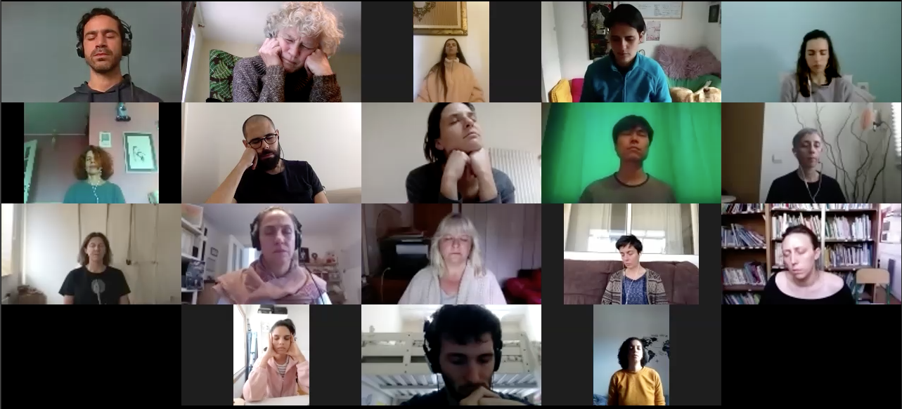
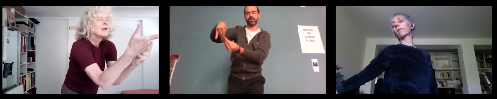
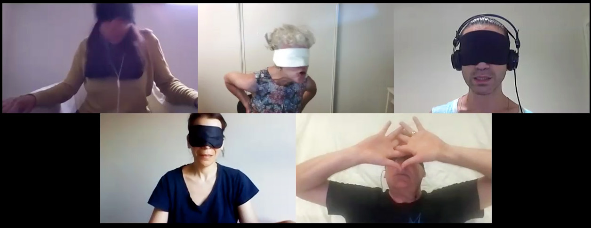

# **Distant Feeling(s) \- a recipe** **connecting telematically over distance  \- fighting alienation**

**Annie Abrahams artist**

**Class of E-lit:** Performance, mindfulness, training

**Dish:** a shared plate with unexpected ingredients of your own making

**Required ingredients:** Interested participants, Computer or phone with videoconferencing tool installed. Quiet environment / solitude. Internet connection. A timer with an alarm.   
**Preparation and cooking time:**  20 minutes.

**Number of servings:** weekly serving recommended 

**Rating: 🍳 Easy**

## **Background:**

*a bodylessbody, only fingers and a brain with a metaphorical thumb, gebombardeerd door tegenstrijdige berichten, onnodige informatie, a frenzy through the nerves, thresholds lowered and heightened at un-will, will, until ..... constraint by character limits, awry translations and a hurting neck, arm, elbow, eye, lower back, pain, thoughts going weary, not flowing, no flow, no touch, connection*

Our bodies are often absent and get very little attention in our electronic life and our interactions with the machines. Our online relations evolve through clicking, thumbing and chatting. Our hands and brains are in use, while the rest of our body gets ignored. While connected to an overload of friends and information, we become restless and even lonely.

This recipe helps to counter electronic restlessness, to connect over distance, to create consciousness of kinship and to bridge differences. It trains us how to be together "with." 

It is a recipe for a silent, yet sentient, relational encounter, materialized as a telematic embrace where nothing seems to happen and where the lack of apparent action transforms the concept of agency. Thus revealing a potential way for fighting alienation.

In January 2025, a few days before his unexpected death Daniel Pinheiro, co-founder of *Distant Feeling(s)*, wrote after our 8th yearly reconnection:

*'Disconnection’ might be the strongest feeling nowadays. At least, for me, it is. In a world where constant digital interactions often mask a deeper sense of isolation, the experience of true connection feels increasingly rare. Distant Feeling(s) reflects on this pervasive disconnection—how distance shapes our ability to connect and how, in some ways, it seamlessly evades our attempts to bridge it.*

*We are rarely, if ever, in a virtual environment with the explicit purpose of connecting with others while consciously reflecting on what that connection truly means. Most of our digital interactions prioritize immediacy, convenience, or productivity, leaving little room for mindful contemplation. With each reconnection, DF becomes a deliberate ritual to pause and explore what it means to connect with one another across physical and virtual distances.*

*Intentionally simple, the invitation asks participants to silently tether themselves to this shared environment. The welcoming is a space to acknowledge the presences. The moment we close our eyes, we surrender to the collective, even as we remain apart. And when we open them 15 minutes later, the world feels subtly altered. It’s not just about closing the distance between us; it’s about creating a moment of genuine communion—a space where distance and disconnection give way to presence and unity, however fleeting.* 

If you want to escape the consumerist content that floods your streams, the algorithms that dictate personal choices, the noise of productivity, this recipe is for you.   
If you want to experience a meditative online connection, if you want to spend time with others while being separated, this recipe is for you.   
While closing your eyes and not talking in front of a screen, it offers an intangible personal experience of co-existence with others, disrupting what the digital space has become.

## **Samples before you cook**

For recordings and notes on 22 *Distant Feeling(s)* sessions see daniel-pinheiro.tumblr.com/distantfeelings ([https://daniel-pinheiro.tumblr.com/distantfeelings](https://daniel-pinheiro.tumblr.com/distantfeelings)) and / or bram.org/distantF ([https://bram.org/distantF](https://bram.org/distantF/index.html))

## **Additional reading and watching**:

*Distant Feeling(s),* Annie Abrahams & Daniel Pinheiro, *Inside the YouTube Decade*, Page 185-193. Video Vortex Reader III, Institute of Network Cultures, Amsterdam 2020\. networkcultures.org/blog/publication/video-vortex-reader-iii-inside-the-youtube-decade ([https://networkcultures.org/blog/publication/video-vortex-reader-iii-inside-the-youtube-decade](https://networkcultures.org/blog/publication/video-vortex-reader-iii-inside-the-youtube-decade))

*“Why is the use of videoconferencing so exhausting? An analysis on the demands.* ANNIE ABRAHAMS AND DANIEL PINHEIRO",  Abrahams, A., Pinheiro, D., Carrasco, M., Zea, D., La Porta, T., de Manuel, A., … Varin, M. (2020). Embodiment and Social Distancing: Projects. Journal of Embodied Research, 3(2), 4 (27:52). DOI: doi.org/10.16995/jer.67  ([http://doi.org/10.16995/jer.67](http://doi.org/10.16995/jer.67))

## **Recipe**

### **From the chef:**    
In 2015 Daniel Pinheiro, a researcher / performer in telematic art from Porto, and Lisa Parra, a choreographer from New York, asked me to participate in their online piece called *Placelessness*. On that occasion we decided to test if our feelings of online affective connection in front of a webcam would still exist when removing the fundamental senses that normally allow connectedness to happen. We sat silently with closed eyes in front of our computers trying to experience the others’ presence across the network. It was an extraordinary experience that in the years to come became a yearly ritual celebrating online togetherness, while meditating on our entanglement with the machines and what that meant to us. We continued to be fascinated by the shared sound environment where individual home environments mixed with the noises of the machines; all altered by the algorithms of the videoconferencing tool.   
I personally still am intrigued by the intimacy it created, especially the moment we opened our eyes and looked at the others with whom we surrendered to a time in "idle" contemplation and whose "abandoned" faces we can still ponder in the recording.

### **Directions** 

* Send out an invitation for interested people to participate in a shared moment of togetherness across a distance.  
* At the set time open a videoconferencing meeting where all participants can see each other.  
* After a simple welcome, ask them to keep video and sound on while they close their eyes and engage in a 15-minute silent encounter. The sounds of the different environments of the participants will create the common space. While they are blind for the duration of the event, the eye of the webcam will witness the time passing on their faces. The session will be recorded and will be available for all participants afterwards.  
* Set an alarm so everyone will be warned of the end and can open their eyes to  look at each other before saying goodbye.  
* There is no spoken evaluation.

### **Variations / extensions** 

*Utterings.*   
When you have tasted this first *Distant Feeling(s)* plate you may be interested in another experience. 

In *Utterings*, an online research and performance project with Daniel, Constança Carvalho Homem, Curt Cloninger and Nerina Cocchi, we gather online and, while blindfolded, engage in utterings as communication, building on solos, duos, chorales and silence.   
You can visit a link to samples for inspiration and lots of notes on our research, process with thoughts on voice, language, silence, listening, hearing, affect, politics, the role of an audience and even erotics...  here: utterings.hotglue.me ([https://utterings.hotglue.me](https://utterings.hotglue.me/))  
The basic recipe is the same as the one for *Distant Feeling(s)*, but in *Utterings* you wear a blindfold and must use your voice. 

What follows are some tips to make the experience interesting and not just a playful shared moment.

* Don't do this with more than six people at the time. Less than four is also difficult.   
* Ask all participants to listen to a sound piece at the same time at the start of a session. We call this attuning; it brings everyone to a "same" register.  
* Only use your voice to make sounds, nothing else.   
* This is not about singing or creating music, it's about communication beyond language.  
* Listening to each other might be the biggest difficulty in the beginning.  
* Silence is beautiful\! 

*Distant movements*

*Distant movements* is also based on attentive presence. Again we close our eyes, but we leave our seated fixed position. We are going to explore an experience of dance in front of a screen, guided by the voice of the one who organizes the session.   
At the start the organizer emphasizes that *Distant Movements* is not about aesthetics, but about perception and that all movements are "good" movements. They explain that in the beginning we favor slowness to heighten our own body awareness and the awareness of the presence of others, even if we don’t see them.  
Everyone starts balancing with their eyes open, slowly activating their body. After some time the organizer asks to close the eyes while continuing the balancing. They also announce a theme for the session. (just one word; something like: breathing \- the blood flowing \- the space of your body \- the wind \- an animal \- a recent event \- )  
While dancing themselves the organizer starts giving incentives concerning the theme, but makes these slowly lesser and more and more general:  
*don’t forget to breathe*  
*remember to stay aware of your body*  
*your toes move too*  
*think about flexibility*

*Distant Movements* has been developed by Daniel, Muriel Piqué and me. You can find recordings, notes, and a protocol on our website distantmovements.tumblr.com ([https://distantmovements.tumblr.com](https://distantmovements.tumblr.com)), which is partly in French.

Enjoy cooking, hopefully the *Distant Feeling(s)* recipe will help you to perceive new approaches in online connection(s) and inspire you to invent variations that will even go further.   
Beyond online habits and imposed constraints.

## **Notes**  
None of this would have been without Daniel Pinheiro, with whom I co-founded these projects and who became over time a very dear friend. We shared a profound interest in the place of the body (and affect) in the digital. Daniel was inspiring, generous, delicate and delicious. He is sorely missed.
