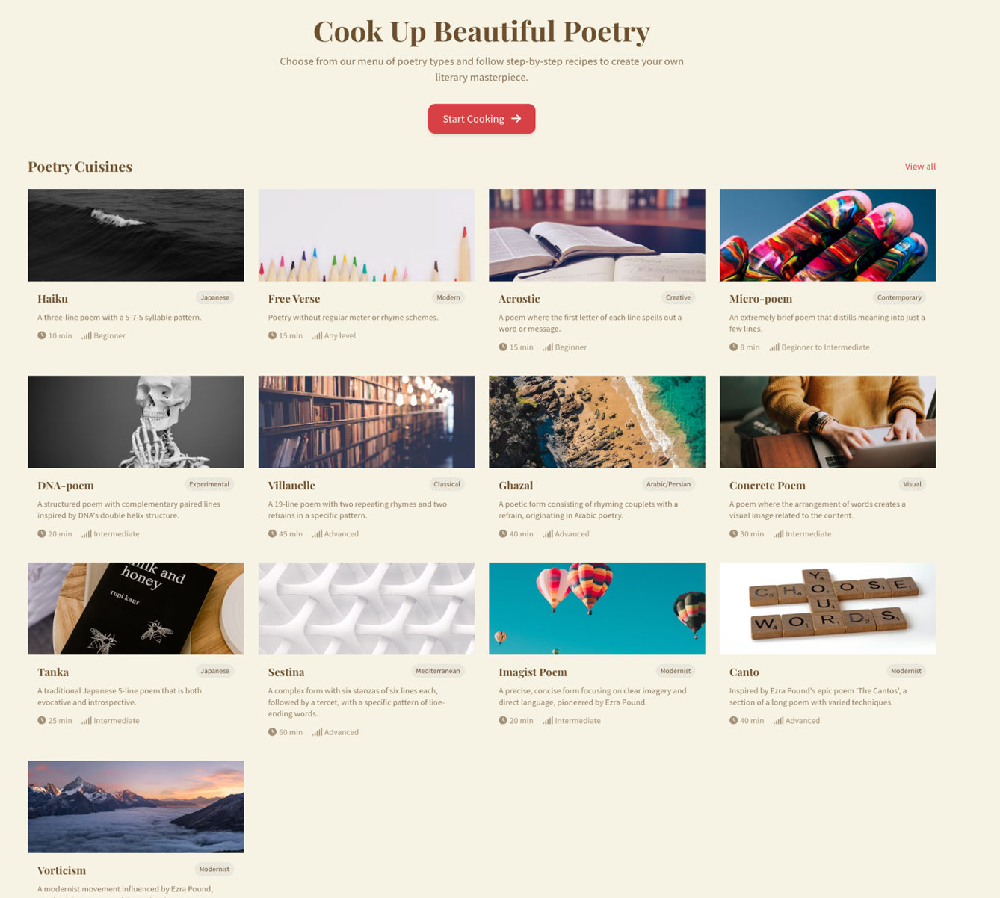
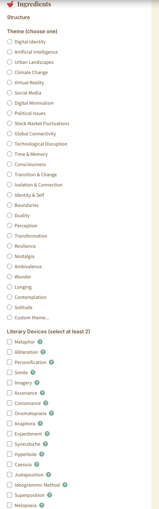
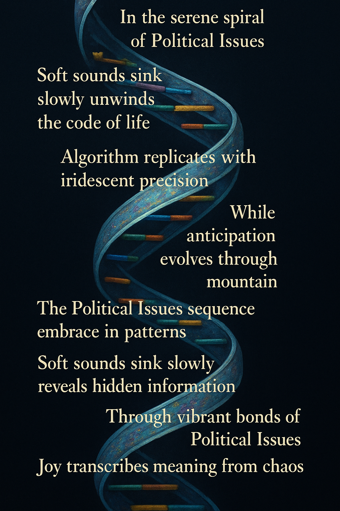

# **Human in the Soup: Literary Taste Designed as Ready-to-Read Six Poem Course Plate with an Easy Algorithmic Model and Directions**

**Andrew Klobucar**  
Associate Professor of Humanities (English) and Director of Communication and Media (Professional Communication)  
New Jersey Institute of Technology

**Class of Elit**: Text Generators  
**Dish**: Ready-to-read six-poem course plate of electronic poetry  
**Required Ingredients:** WiFi, a laptop and the free app “PoemChef” (https://poemchef.andrewklobucar.com/)  
**Preparation and Cooking Time:** 5 minutes per course for 30-minute “(Dis)Course Plate.”  
**Number of Servings**: Six with an enchanting variety of serving sizes for each poetic course  
**Rating: 🍳🍳 Two pans, medium with a slice of patience**

## **Background:** 
We’ve all been there. We’re always on the lookout for a good literary tasting plate laid out as individual discourses, performed in an open reading space. The event typically pays little more than a single free beer we pick up at the door, yet the chairs are full, and we feel we might have a few pages or digital tools that are ready for a bit of public feedback; so we put aside the fears as we stumble towards the mic, feeling like latecomers in a new Netprov roleplaying event[^1].   
If a poet at any stage in their work is looking for something a bit more sustainable in the latest literary stream, while still needing access to a strong set of core discourses ready to be curated for the right mood for a multi-generational audience, here is a quick set of recipes for a ready-to-read performance we call “Human in the Soup,” a play on the question that plagues us all as writers and readers who easily recognize that electronic writing has entered a very new era of literary production. The “Cybertext” we had once proudly introduced as the perfect scholarly adaptation to how writing would evolve in the new digital era back in the late 1990s seems today increasingly threatening, capable of operating and producing more textual experimentation without our intervention.   
The discourse plate introduced here suggests that the use of generative systems and interactive media might be a working answer to the primary question we all face in this new GenAI epoch: namely, where is “the human in the soup?” The code recipes that follow are spawned from a poetry generator app that allows writers to produce poems in a select number of genres by choosing themes and formats directly from an interactive writing tool I’ve titled “PoemChef.” The context I am using is a (dis)Course Plate of six poems to be served up, using the app to build each one. My aim is to provide a writing tool that allows you to add different themes and elements, choosing each one from a pre-arranged set of styles and grammatical structures provided in the tool; I consider it an algorithmic buffet ready to produce a course plate built by new work able to take advantage of generative systems and produce works on the spot. 

## **Sample before you start cooking:**  
 

## **Directions:** 

Opening the app provides an easy way to produce different genres of poetry. Clicking any genre will open your workspace, and that’s when we officially enter the poetry kitchen. Here’s an overview of the options to write lines ourselves in the suggested format, while generating others if we choose. The aim of becoming a skilled Poem Chef is to maintain control over your creations, as future generative systems technologies will continue to challenge us to keep the human element somewhere in the process.


As we see in figure two, the app provides a list of poetry themes under the heading “Ingredients.” One of the key elements to creating a “discourse plate” in the style we are about to see is to try and combine different genres together to create poetic consistency ready to served as an electronic literary feast. Beneath the theme list is a secondary list where a minimum of two “literary devices” must be chosen. The ingredients shown in apply to all poetry style choices on the main page. For this reason, I would consider the Discourse Plates a single genre of electronic poetry that consists of multiple sub-genres provided by the application. It is most important to see how the sub-genre servings, when placed together, successfully create a consistent shift in rhythm by moving steadily from one theme to the next via the writer’s clickable selections in literary devices.  Our next choice is to choose a genre or build a new one into the application as it now appears and functions. While interacting with the software, the poem chef still maintains the choice of completing any number of lines she wishes while allowing the tool to generate more lines if necessary. In this way, the finished work remains cybernetic where we are provided a new generative system as a writing partner.

# **A few recommended starters:**

# **Amuse-Bouche: MicroPoem – The Chasm of Consciousness**

We should see in the first row the very first course in our algorithmic meal of new works to try and sample: Our Amuse-Bouche will consist of a single, perfect drop of concentrated essence—three lines that burst with meaning on first contact. Like caviar on the tongue, this miniature marvel contains entire worlds compressed into one delicate form. Pairs exquisitely with a voice barely above silence, each word a precise trimming dropped into stillness.  
**Recipe Type: MicroPoem**

A byte-sized hors d’oeuvre offered as a gift from the poem chef to the experience. Often whimsical and surprising

| OBSIDIAN GALAXY OBSIDIAN SKY: VIRTUAL REALITY MEETS PATTERN. LIMINAL UNCERTAINTY.  | Recipe Details/choices: The poetics of compression in language Difficulty: 🍳 Cook Time: 8 minutes  Ingredients: 2-4 lines Highly Condensed Meaning  Theme: Consciousness Literary Devices: Consonance Juxtaposition  |
| :---- | :---- |

```
type Tab \= 'recipe' | 'instructions' | 'notes';  
const CreatePoem \= () \=\> {  
  // Route params  
  const \[match, params\] \= useRoute('/create/:poetryType');  
  const \[, navigate\] \= useLocation();  
  const { toast } \= useToast();  
// Fetch poetry type  
  const { data: poetryTypes } \= useQuery\<PoetryType\[\]\>({  
    queryKey: \['/api/poetry-types'\],  
  });  
// Initialize structures based on poetry type  
  useEffect(() \=\> {  
    if (currentPoetryType) {  
      // Set page title  
      document.title \= \`Create a ${currentPoetryType.name} | PoemChef\`;  
      // Initialize lines array based on poetry type  
      const typeName \= currentPoetryType.name.toLowerCase();  
if (typeName \=== micropoem) {  
        initialStructure \= {  
          "3 lines total":
```

# **Recipe Type: Appetizer: DNA-poem – In the serene spiral of Political Issues**  
We’ll want to move quickly through the micro-poem with a more lifelong themed recipe, and I recommend a DNA Poem to basically “activate” and appetize our ears with a much-needed appreciation for molecular gastronomy—verse we structure in spiraling double helices, where meaning winds around itself in complementary strands. Ideally, with this work, our twists and turns of line mirror and respond to its partner, and when prepared properly, it creates an artificial paradigm for a genetic code of language.   
Here, we continue to offer a recommended voice pairing with each recipe. But for this one, we can combine two-voice pairings parallel to the words intertwining:

|  Figure 3\. DNA appetizer served, officially combining identities within reading experiences  | Recipe Type: DNA Poem Recipe Details:  A twisting of code showing the distinctive details of movement and life in the poem as organism Difficulty: 🍳 Theme: Digital Identity Literary Devices: Anaphora Superposition |
| :---- | :---- |

```
if (typeName \=== DNA) {

        initialStructure \= {

          "0 lines total":

import RecipeInstructions from '@/components/Images/RecipeInstructions';

import { ColorPaletteGenerator } from '@/components/ColorPaletteGenerator';

type Tab \= 'recipe' | 'instructions' | 'notes';

import image; DNA.jpeg
```

# **First Course: Canto \- Digital Identity in Shimmering Light**

Nothing follows a well-structured DNA poem than a hint of a special vintage technique, aged to perfection—where surface meaning still conceals special sweet or savory messages spelled vertically through initial letters. Like any fine reading you may remember from your past, we can still see how the complex notes slowly reveal themselves. Again, the human can be in the soup, but this form rewards careful human attention to both overt and covert flavors. We find that it is best served with a voice that subtly emphasizes the architectural letters, creating a secret scaffold of sound. It may take some practice, but it always signifies to me the exact form where electronic writing was always alert to the structure of analogue practices before it.

| THE RECORD Liminal Digital Identity from forgotten time WE PARTIED LIKE IT WAS 1999 The Asure desert harmonizes with grace  REVEALS CULTURAL MEMORY THE VISION The echo unfolds with bridges  THE MOMENT Pattern and Digital Identity collide in contemplation The tenuous moments dance / transforms experience into form | A visual sense of language composed to stimulate the appetite and get it ready for the main course – often best read with fresh Tartare with Quince and Crackers  Recipe Type:  Canto Recipe Details: Free-flowing section with multiple literary techniques, historical references, and linguistic experimentation Difficulty: 🍳🍳🍳🍳 Cook Time: 40 minutes Theme: Digital Identity Literary Devices: Anaphora Superposition |
| :---- | :---- |

```
  // Initialize lines array based on poetry type  
      const typeName \= currentPoetryType.name.toLowerCase();  
if (typeName \=== canto) {  
        initialStructure \= {  
               let lineCount \= 9;  
 "6 lines upper case":}}
```

# **Main Course: Villanelle** – **Resilience’s Hunting Journey**  
We want to keep our pacing  now as we have our main course that complements the canto’s unparalleled combination of form and voice. Now we are ready for an even more visual feast, where the poem provides a multidimensional sculpture that is quite literally a work of art. We want to make sure that the words you write are arranged as a powerful architectural form on the page. It might seem by this time in the meal that we have provided a complete structural feast already, but, as we see here before our palate cleanser to come, if we look see and invoke the meaning as a ready activity of shaping itself before our eyes and ears, the art of typography becomes surprisingly easily to build a poetic topography. This work typically pairs beautifully with a voice that traces the visual journey, rising and falling with the poem's physical landscape. 

| Resilience dissolve with enigmatic grace (A1) Chasm that transforms and speaks reveals what we cannot face (B) Excitement finds us in every place (A2) Serene pattern with contemplative grace (a) Reverence finds us in every place (A2) We seek the Resilience that might release (a) Resilience dissolve with luminous grace (A1) Shadowed paradigm brings a strange peace (a) Awe finds us in every place (A2) Identity that harmonizes and speak gives Resilience new release (a) Resilience navigates with fierce grace (A1) Sorrow finds us in every place (A2) | The main savory highlight highlights a combination of rich stories in a poetic structure, read in a rich reduction with a saucy voice – chanting is also recommended for solo experiences.  Recipe Type: Villanelle Recipe Details: 19 lines with 5 tercets and a quatrain using A1A2, abA1 pattern  Difficulty: 🍳🍳🍳 Cook Time: 45 min Theme: Resilience Literary Devices: Personification: Giving Human Characteristics to Non-human things Logopoeia: The Dance of the Intellect  |
| :---- | :---- |

```
  // Initialize lines array based on poetry type  
      const typeName \= currentPoetryType.name.toLowerCase();  
if (typeName \=== canto) {  
        initialStructure \= {  
               let lineCount \= 19;  
 "typeStructure \= A1,A2, abA1":  
}}
```

# **Pre-dessert Course Palate Cleanser: The Network of Digital Minimalism**

|  DIGITAL MINIMALISM VORTEX Profound Whispers, rustles, and sighs  Lack of agency  Whirling Crystal Method  Spiraling AROUND Gratitude CENTRIFUGAL Digital Minimalism at core | A small, often light and refreshing poem or image served just before a rich dessert courses—typically between rich or strongly flavored meaning—to neutralize the taste buds and repair the mind for the next poetic experience, wherever, whenever and however it comes. Recipe Type: Vorticism Theme: Digital Minimalism  Literary Devices: Metaphor Imagery |
| :---- | :---- |

```
  // Initialize lines array based on poetry type  
      const typeName \= currentPoetryType.name.toLowerCase();  
if (typeName \=== vortex) {  
        initialStructure \= {  
               let lineCount \= 9;  
 "// Extract the current poetry type from the route param  
  const currentPoetryType \= poetryTypes?.find(  
type \=\> type.name.toLowerCase() \=== params?.poetryType?.toLowerCase()  
  );
```

There are several sweet finales I recommend that can easily provide a complex yet satisfying ending for the meal. This course can also offer an excellent opportunity to feature whatever words may be in season at any one time. It typically appears as a tightly organized set of lines, creating a complex texture that also lends an elegant presentation. One of my personal favorites makes use of the Haiku since it ably completes strong readings with deceptively simple finales. PoemChef also features this genre. Of course, the most crucial point to remember is that while algorithms provide structure, the human ear and voice add the authentic flavor to the texts we strive to produce and enjoy.

## **Notes:**
[^1]:  Netprov is one of the longest, ongoing digital art forms, going online over 20 years ago thanks to its creators, Mark C. Marino and Rob Wittig. The activity might be best described as a live and open-ended experiment in role-play and modes of collective writing. For both authors, the project shows how an ongoing performance can help us question issues in roles and power dynamics we associate with the author and reader in digital interactivity. 


