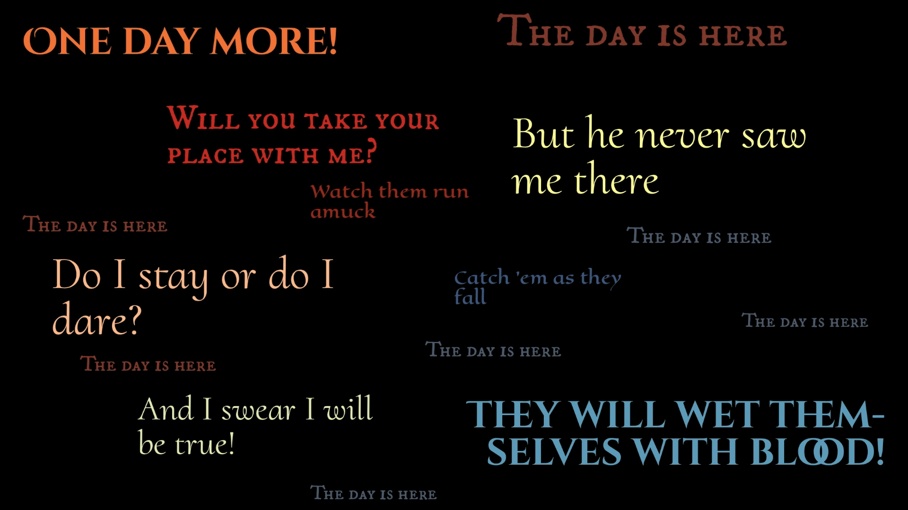
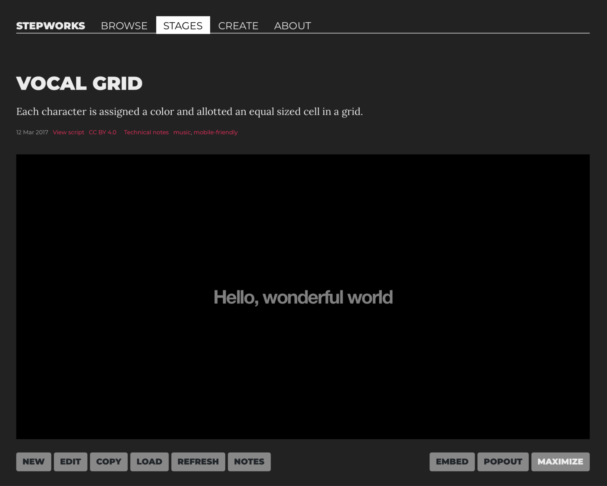

# Interactive Lyric Videos with Stepworks 

Erik Loyer

Media Artist, Creative Technologist

##Recipe 1: 

**Class of E-lit:** Interactive lyric video   
**Dish:** A syllable-accurate lyric video you can perform live   
**Required ingredients:** Computer, text editor, lyrics from a favorite song with a single vocalist, Google Sheets, Stepworks   
**Preparation and cooking time:** 15-25 minutes   
**Number of servings and serving size:** One lyric video  
**Rating:** **🍳 one pan, easy** 

## **Recipe 2:** 

**Class of E-lit:** Interactive lyric video  
**Dish:** A syllable-accurate lyric video for multiple vocalists that you can perform live  
**Required ingredients:** Computer, text editor, lyrics from a favorite song with multiple vocalists, Google Sheets, Stepworks   
**Preparation and cooking time:** 25-45 minutes  
**Number of servings and serving size:** One lyric video  
**Rating:** **🍳🍳 two pans, moderate** 

## **Background**

Have you ever watched a lyric video on YouTube, where the words to a song appear on screen in time with the music? Even before the term “lyric video” came into use, I found there to be something magical about this format. I think it’s because words can have such surprising, sudden effects on us — as much as any tangible object — and yet, they have no physical presence when spoken or sung. Whether they emerge from the organic vibrations of a cartilaginous larynx, or from the mechanical movements of an electrodynamic diaphragm, the unique sounds our brains transduce into meaning do not literally hang in the air as visible language. The lyric video, however, appeals to the part of us that wants them to, inviting us into an illusion that the singer’s voice is conjuring visible language in real time.

*Still from an unofficial multi-channel lyric video for “One Day More” from* Les Miserables*, created with Stepworks.*

This illusion has long been a fascination for me. In a 2007 piece called “Swing” ([https://erikloyer.com/index.php/projects/detail/swing](https://erikloyer.com/index.php/projects/detail/swing)), I first experimented with the idea of an interactive lyric video; one in which the user’s gestures would cause the lyrics to advance, one syllable at a time. While creating the piece I found that, when performed with the right timing, there’s a peculiar feedback loop that happens in which one feels that they are both “playing” and “being played by” the singer’s words. This dynamic was part of the genesis of my home-grown rhythmic storytelling tool Stepworks ([https://step.works](https://step.works)). 

Many years earlier, while reading James Joyce’s *Ulysses* as part of my undergraduate studies, I became fascinated with the ways Joyce found to give anything in the world a voice, be it a living being, elemental matter, infrastructural system, or inanimate object. My immersion in the book caused me to see the world around me with new eyes — a world in which everything was constantly speaking, from the patterns in the fabric of our dingy college apartment furniture to the passing traffic on the freeways. I began to create little spreadsheets in which columns were assigned to speakers, and rows to speech acts, turning scenes into grids.  

Over the years, as I became increasingly interested in rhythmic performance and typographic animation, I decided to build a creative tool that would make composing these kinds of works easier. I wanted a way to easily sequence the display of words, syllable by syllable, using simple one-button interactions, turning language into a kind of drum. Drawing upon the spreadsheet format I had experimented with in college, I used Google Sheets as the basis for the first version of this tool, so that users could quickly start writing their own dialogues, importing them into the tool, and performing them on screen using a few different templates. 

One template that became especially popular was called “Vocal Grid,” because it assigned each speaker (i.e. each column in the spreadsheet) a portion of the screen where their words would be displayed, making it possible to animate complex sequences featuring multiple singers or speakers with minimal effort. Given the popularity of the musical “Hamilton” at the time, with its dense, multi- character vocal performances, making lyric videos for various songs from the production was a natural next step, and proved an immediate hit. Lyric videos for “Alexander Hamilton” and “Non-Stop” received millions of views from fans of the musical, who reported clearer understanding of Lin-Manuel Miranda’s elaborate wordplay from the format. Some of those fans ended up using Stepworks to create their own lyric videos for many other songs from the musical\!  

## **About Stepworks**

Stepworks ([https://step.works](https://step.works)) is a website that lets you create lyric videos (and many other kinds of rhythm-driven experiences) for free. Currently the website contains two versions of the Stepworks authoring tool: one called Stepworks Classic that’s based on Google Sheets, and another called Stepworks Studio that’s more of a standalone app. We’ll be using the first version, Stepworks Classic. You can find it by opening the Stepworks website and scrolling down until you find the Stepworks Classic link. Stepworks Classic allows you to use a Google Sheets spreadsheet as a “score” to choreograph the display of text on the screen. When the score is performed, each mouse click or key press will advance one row in the score, allowing you to perform it live, in your own timing, like a musical instrument that plays text instead of notes (it can actually play notes too, but that’s beyond the scope of these recipes — you can learn how in the “Create” section of the Stepworks Classic website\!) 

## Recipe 1: Single-Channel Interactive Lyric Video 

**From the chef:** *This recipe will start simple by showing you how to create the script for an interactive lyric video you can perform yourself in time with a favorite song. The real magic of an interactive lyric video has to do with its syllable-accurate timing. By breaking the lyrics down into this most basic rhythmic unit, so that pressing a key causes the next syllable to be displayed, we effectively turn words into drums that can be easily played just by recalling the timings we’re already familiar with. Instead of singing along, we press keys with the same cadences, instantly creating a perfectly-timed lyric video.* 

### Directions: 

1\. 	Pick a favorite song with a single vocalist. Ideally you want a song that’s not too long or complicated, and one you can sing along with by heart. Find the lyrics of the song somewhere online, and then copy and paste them into the text editor of your choice. 

2\. 	In your text editor, split the lyrics into syllables, one syllable per line. If you want to avoid some tedium, you can look up a syllable splitter website that will do this for you (usually by inserting hyphens between each syllable), and then use the find and replace features in your text editor to get each syllable on a separate line. 

3\. 	Add an ampersand “&” to the beginning of every word and syllable. This will tell Stepworks to append that syllable to the previously displayed text, instead of replacing it. Don’t forget to include the spaces between words so they don’t all run together, and don’t add ampersands to the beginnings of stanzas or other places where you’d rather the new text replaced the old. As an example, the phrase “Hello, wonderful world” would become this in your text editor: 

Hel 

\&lo, 

& won 

\&der 

\&ful 

& world 

4\. 	Open Google Sheets and create a new document. Put the name of the vocalist at the top of the first column. Make it bold to set it apart from the text you’re about to add. 

5\. 	Select and copy the lyrics in your text editor and paste them into the second row of the first column, just below the vocalist’s name. After pasting, you should see each line of your text slot into its own row in the spreadsheet. 

6\. 	Give the spreadsheet a title, and click the “Share” button in the top right. Change the access rules to “Anyone with the link” and click “Done”.

7\. 	Copy the uniform resource locator (URL) from the location bar in your browser (don’t use the “Copy link” option from the Share options). Open this URL: [https://step.works/index.php/show/vocal-grid](https://step.works/index.php/show/vocal-grid), scroll to the bottom, and click “Load”. Paste in the URL you copied in Step 9, and click “Done”. 

8\. 	Stepworks will load in your spreadsheet (you may not see any visible change). Click the red circle that says “Click here,” and you should see the first syllable of your lyrics appear. Keep clicking or pressing keys to step through the rest of your lyrics. Make sure everything is appearing as it should. If you need to make changes, go back to the spreadsheet to edit, and then come back to Stepworks and click “Refresh” at the bottom to reload it. 

9\. 	Now comes the fun part\! Click “Refresh,” put on the song, and then click or press keys in time with the music so that the lyrics sync up with the vocalist.  

*Final result of the single-channel interactive lyric video recipe.*

### Notes: 

Try making a screen capture of your performance and editing it together with the song to create a finished piece that you can share with others\! 

## Recipe 2: Multi-Channel Interactive Lyric Video 

**From the chef:** *In a bit of a nod to video art, I call these works “multi-channel lyric videos” because of the way they turn different areas of the screen into “channels,” each of which displays the words of a single character simultaneously alongside the others.* 

### Directions

1\. 	Pick another song, one featuring two or more vocalists (musicals are a great source here). As the number of singers and the density of the lyrics increase, so will the difficulty of this recipe. As before, find a source for the lyrics and copy them into your text editor. 

2\. 	Repeat Steps two and three above. 

3\. 	Repeat Step four above, but instead of creating a single column, create one column for each of the vocalists in the song. 

4\. 	Repeat Step five above, pasting all of the lyrics into the first column just as you did before. 

5\. 	Cut and paste the lyrics for each vocalist into their respective columns in the spreadsheet. Remember that each row represents a single syllable, so each row should only contain content for multiple columns if those vocalists are singing syllables at the exact same time.

6\. 	Repeat Steps six through nine above. 

### Notes:

There can be something thrilling about performing one of these multi-channel lyric videos, especially when you can allow your familiarity with the song to drive the timing of your key presses, without a lot of conscious thought. That said, depending on the complexity of the song you’ve chosen, and how tightly interwoven the vocal parts are, the performance aspect can become quite demanding (and hard on your hands)\! One way to deal with this is to take a different approach to the timing.  

So far, we’ve assumed that each row of the spreadsheet corresponds to one syllable, but for extremely complex pieces, we can assume instead that each row corresponds to a fixed duration of time, say one beat. This requires a bit more musical knowledge, but has the advantage of allowing us to group multiple syllables under a single keypress, so that as a performer, we can simply press keys at a regular intervals to trigger highly complex syllable timings, even across multiple characters. To learn more about adding this kind of timing to your piece, visit [https://step.works/index.php/create/delays](https://step.works/index.php/create/delays).

Once you get familiar with the concept of building lyric scores in spreadsheets, there’s all kinds of fun you can have performing along with your favorite music, poetry, or whatever other time-based text you can think of. Everything speaks — and lyric videos can help us to listen.

## Resources:

“Swing” lyric video: [https://erikloyer.com/index.php/projects/detail/swing](https://erikloyer.com/index.php/projects/detail/swing)

Stepworks authoring tool: [https://step.works](https://step.works)

“Vocal Grid” template in Stepworks: [https://step.works/index.php/show/vocal-grid](https://step.works/index.php/show/vocal-grid)

More about timing in Stepworks: [https://step.works/index.php/create/delays](https://step.works/index.php/create/delays)

