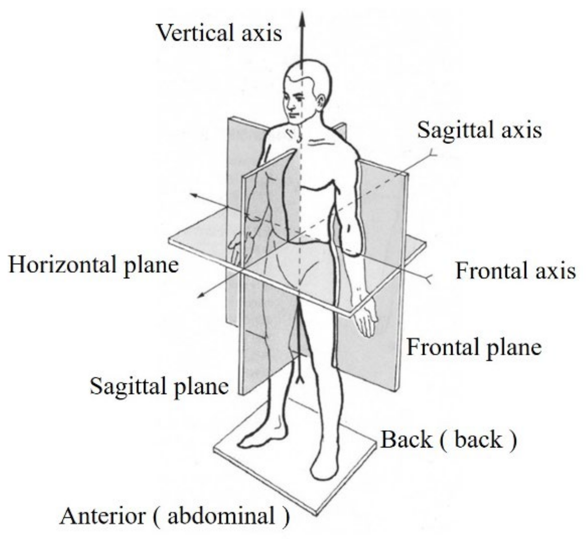
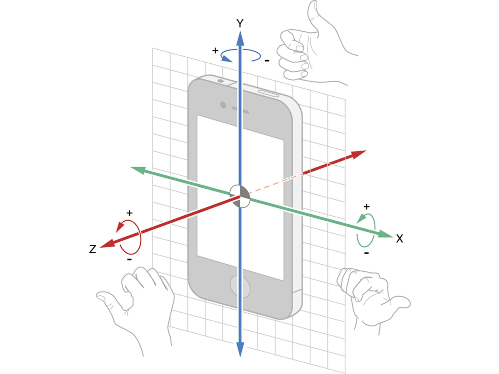
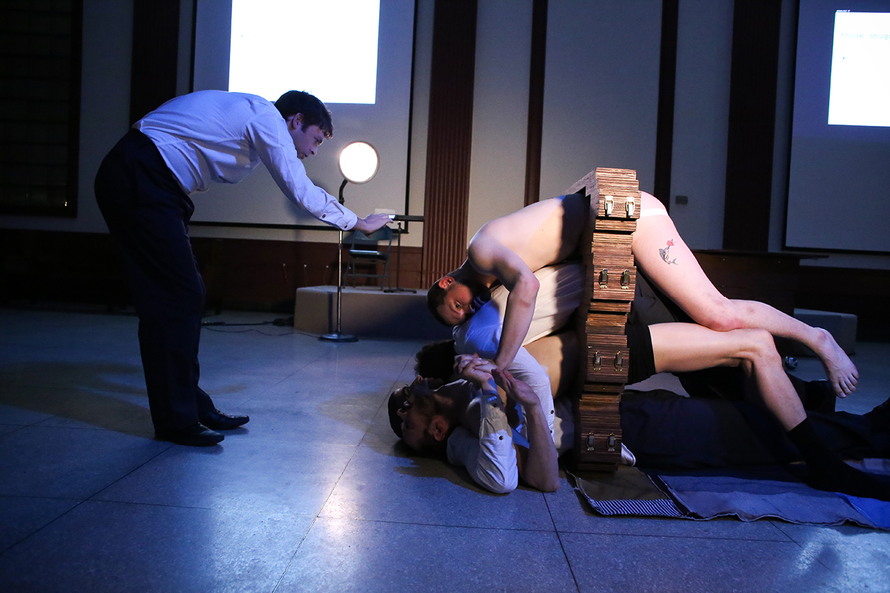

# **Jolly apogee: A Minimal Embodied Gesture Poem**

**Judd Morrissey**  
Associate Professor, Art and Technology / Sound Practices (Chair)  
School of the Art Institute of Chicago

**Category:** Digital multimedia   
**Class of E-Lit:** Processed poem; performance  
**Rating: 🍳 🍳 🍳** challenging

**Background:** Over the years, I have cultivated a practice merging computational poetics with embodied performance through the use of body-responsive literary interfaces, augmented reality, and immersive 3d scans. In my collaborative work, as co-founder \- with Performance-based artist, Mark Jeffery \- of Anatomical Theatres of Mixed Reality  (ATOM-r), these mechanisms have been inextricably woven into the pattern of large-scale group performances incorporating movement, text, media, and scenography.

The recipe I would like to share is one derived from ATOM-r’s first major performance, *The Operature* ([https://vimeo.com/224378134](https://vimeo.com/224378134)).  This work was developed in relation to two primary sources: the history of medicine and the architectural form of the anatomical theatre, on the one hand, and the life and work of Samuel Steward, on the other. Steward was a Chicago-based writer and tattoo artist who was a friend of Gertrude Stein but followed his artistic and physical desires in a unique body of work encompassing low-brow gay pulp fiction, countless needled inscriptions upon and within the skin of sailors, and through the accumulation over many years of his *Stud File*. Steward's *Stud File* is a card catalogue of his sexual encounters with a coded system for cross-referencing attributes of men and intimate experiences while protecting the identity of lovers and tricks at a time when anti-sodomy laws were still in place. Steward's archive, begun as early as the 1930s and spanning at least 50 years, extended beyond index cards to include drawings, writings, ephemera, and biological samples including body hair.

In retrospect, my encounter with Steward, via the symbol of the anatomical theatre, marked the beginning of a gradual personal transition from a hypochondriac orientation resulting from externalized and internalized homophobia and the fear of hiv/aids, to an embrace of a liberatory sexuality, in which the symbolic and real domains  of health and medicine became not a primal scene of punishment but a tool to navigate desire safely. It was also through this work that I moved from the disembodied wizard behind the curtain into the performance space, largely due to the increasing portability of everyday technologies that I was using to generate poetic systems. While my practice of embodied electronic writing  continues to evolve to reach new apogees of integration, the earliest poems made use in a minimalistic way of the basic affordances of mobile media \- ubiquitous access to a compass, gyroscope, accelerometer, and means of accessing gps coordinates. But I continue to use these simple forms both in my work and in workshops I give as an artist and art school professor.

I have settled on sharing an open-ended recipe for a gesture poem based on the closing text *The Operature.* For the sake of ease, I have recreated the poem in the P5js editor so anyone can make their own copy and modify its contents and functionality. The poem can be activated on and performed with a smartphone and remixed into one’s own. Fortuitously, in the spirit of JOEL, who now incarnates in our minds as a joyful lover, the P5 sketch’s generated name is *Jolly apogee.* While the site of the body, health, and sexuality is complex, there is joy to be found in the full and ephemeral life of the body. While the phrase *memento mori* is a reminder of our mortality, this reminder is also meant to foster a feeling of joy in the savoring of present moments. The minimal embodied gesture poem and source code will be shared at the end of this document, but first I’d like to include some more steps, including a constraint-based writing exercise, so that you can make it into a gesture poem of your own.

Let’s familiarize ourselves with two systems relevant to this experiment: the device coordinate system of smartphones, and the planes of the human body. The coordinate system of smartphone device orientation and motion consists of three axes: x, y, and z.

X  
Represents the east-west direction (where east is positive).

Y  
Represents the north-south direction (where north is positive).

Z  
Represents the up-down direction, perpendicular to the ground (where up is positive).

Less practical perhaps for our purposes, let’s have a parallel look at the planes of our bodies:

Sagittal Plane: This plane runs vertically through the body, separating it into left and right portions. A midsagittal plane is a sagittal plane that divides the body into equal halves, while other sagittal planes are parallel to it.

Coronal Plane: Also known as the frontal plane, this vertical plane divides the body into anterior (front) and posterior (back) parts.

Transverse Plane: This horizontal plane divides the body into superior (top) and inferior (bottom) portions. It is also called the axial or horizontal plane. 

Now, let’s begin to orient ourselves towards the writing portion of the process. To inform the experiment, let’s focus on an image, *Self-Portrait of David Wojnarowicz,* to contemplate the entanglement of body, place and event.

In another work, *Untitled Map,* the artist and writer David Wojnarowicz, begins an address, primarily to his friend and former lover, Peter Hujar, with the text: *When I put my hands on your body your flesh I feel the history of the body*.

**Transhistorical Crush**

The artist Tom Burr, inventor of this term, writes in a curatorial statement:

Artists look at other artists. We hear ourselves across time and on the other sides of walls, working, not working, listening, painting, speaking, not speaking. We watch what we make and how we make it. We search for clues, for substance, for stimulation and connection. When we work out and through each other we tangle our language together and produce new sentences, distinct syntax. Our tendencies and our preferences, our ideas and various ways of placing those ideas, our styles even, seem to need the company of each other. There is a politics to placement, and alignment, and company. And there is a genealogy created out of manifestos, practices and love poems, out of close encounters in our immediate surroundings, and out of a trans-historical crush.

Consider: Who is your transhistorical crush?

**Writing Portion**

*(material generated through open-ended writing will be used as source material or inspiration for creating a new set of lines for the poem)*

For 10 minutes (or more), write freely in response to the Wojnarowicz image and the prompt: *Reflect upon the history of your body as both forensics and banquet.*

For 10 more minutes (or more), write freely in response to the prompt: *Reflect upon the life of a body from another time ( as both forensics and banquet.*

**The Source Poem**

At this point, you can experience the source poem in P5js by scanning the qr code or entering the tiny url in your smartphone browser: [https://tinyurl.com/Operature](https://tinyurl.com/Operature).

I recommend that you hold the poem in landscape mode. After tapping the title button, move your hand and arm with some force in the direction in which the finger icon is pointing. The gesture must be strong enough to trigger the phone’s accelerometer which is set to a certain threshold. Continue to gesture to bring up new lines of the poem which you may also read aloud.

**Remixing The Poem**

The poem can be altered in the P5js editor at the following url: [https://tinyurl.com/operEdit](https://tinyurl.com/operEdit). You can then login or signup and save the code as your own.

The two files we are primarily concerned with are [sketch.js](http://sketch.js) and [poem.js](http://poem.js). Sketch will be displayed by default and, if you are not familiar with p5, you can tap the arrow key in the upper left hand corner (next to name [sketch.js](http://sketch.js)) of the editor to access the other files. In [poem.js](http://poem.js), you can create your own remix of the poem incorporating or inspired by your writing exercise. You can do this by simply replacing the quoted lines of text in the array with your own. As a further constraint, consider leaving 20% of the original poem intact. If your poem is longer or shorter, you can simply add or delete items in the array, leaving its structure intact.  You may also create your own array called “lines” and rename mine “lines\_judd” or comment it out.

I have annotated key variables in the source code for those interested in its simple mechanics or who want to programmatically intervene. While it is generally easier to use the editor on a computer, the url of the poem itself must be tested on a phone or tablet (or other device with the appropriate sensors). To do this, you can simply navigate to File \-\> Share and text or email yourself a fullscreen link.

If you create a new poem, by substituting content or altering code, please find me and let me know. I’d like to bring the remix poems out of the p5 environment and host them on my own server. Perhaps we can perform them together at some future ELO event.

