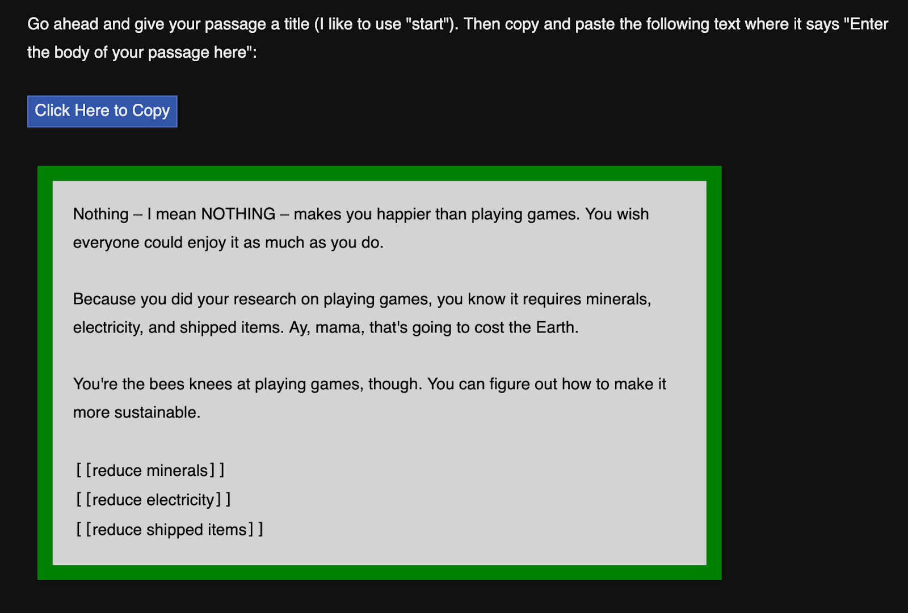
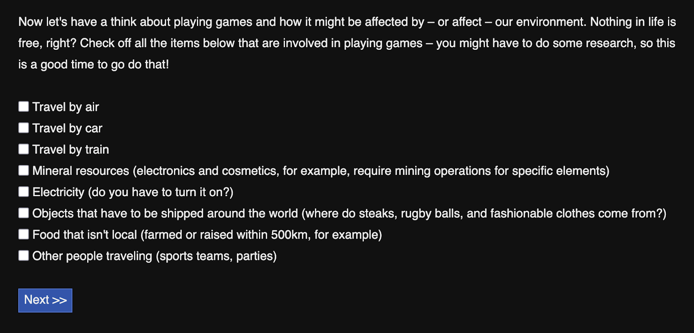

# Kids in the Kitchen: A Starter Dough for New Narrative Designers 

**R. Lyle Skains**  
Associate Professor in Health & Science Communication (Literary Media & Digital Writing)  
Bournemouth University

**Category: Interactive Digital Narrative**  
**Rating: 🍳🍳 (medium difficulty for beginners)**

## **Background:**  
Every burgeoning baker discovers at some point that baking is both chemistry and artistry. Like many artistic skills, baking requires a solid competency in its foundational principles and skills before one can begin to experiment and develop a taste that is singular. The bridge between box-cake consumer and cake designer (or in this recipe, a sourdough baker)—between a player/reader and interactive narrative designer—covers a vast unknown expanse filled with creative challenges, from story ideas to narrative mechanics.

## **Sample Before You Cook:**  
See my discussion of *You and CO2* (YCO2) in the Tastings section of this book.  
In our first couple of implementations of *You &* *CO2* [(Rudd, Horry and Skains 2019\)](https://www.zotero.org/google-docs/?KegqtW), we discovered that many students were incredibly trepidatious about stepping out onto that bridge. Teachers spent the bulk of Workshop 3 just helping students come up with story ideas, struggling to connect to something the students cared enough about to type into a Twine passage. So what’s an experienced interactive digital narrative (IDN) baker to do, other than create an IDN to help new IDN bakers bake new IDNs? Thus was born the supplement to the You & CO2 project, a tool for use in Workshop 3 to give students the building blocks for their very own climate-change-themed IDN in Twine: the YCO2 “Story Prompter” ([https://youandco2.org/prompt/](https://youandco2.org/prompt/)).

The Story Prompter helps new bakers forage and gather ingredients, then puts them together into a starter dough so they have the first few lines of a story and several branching passages that they can simply drop into a new Twine work to serve as a base. Like any good hypertext built with Twine, the prompter offers options for their foraging paths: either to input a story idea they’ve already developed through an exercise included in the YCO2 Teacher’s Pack ([https://youandco2.org/teachers-pack/](https://youandco2.org/teachers-pack/)), or to generate a new idea entirely from scratch.

## **Recipe Version 1: Building from YCO2 Exercise**  
Prompter V1 begins by linking the student to the exercise included in the YCO2 Teacher’s Pack ([https://youandco2.org/teachers-pack/](https://youandco2.org/teachers-pack/)), which simply asks them to get a start thinking about what kind of story they’d like to tell in terms of storyworld, characters, topics, events, and potential storylines. If they’ve already done this exercise, either on their own or in class, Prompter V1 simply walks them through developing the story’s opening passage and a few branching passages, beginning with establishing the storyworld:

Your storyworld can be as simple as "Wales", or as fantastic as "Narnia". You can set it on the Moon or Mars or under the ocean. What about the desert? Or a forest? You could try somewhere you've never been, or somewhere you've only imagined.

Remember, it doesn't have to be an entire planet or city to be a "storyworld". It could be your closet, or the field behind your grandmother's house, or a secondhand store. It could even be a fairy's mushroom, or inside a cheetah's veins\! 

They then choose narrative perspective (first or second person), whether the story is about themselves or someone else (giving names and pronouns for the player-character and one to two additional characters just as in *No World 4 Tomorrow)*, and the story’s time setting (past, present, or future). They’re asked to input the first couple of actions in the story, with options (hyperlinks underlined in bold):

Great, here’s what you have for your story so far:

Your story is set in the future on Post-scarcity space exploration federation, and is about Janeway (someone else, she/her).

The story will be told in 2nd person point of view (“you”).

B’lana (she/her) and 7 of 9 (she/her) are in the story, too.

The events that start off your story are:

You wake up.

and

You don’t know where you are.  It’s too dark to see.

OR:

The alarm is buzzing and the internal lights are slowly rising.

Is this correct?

**Yes, I want to create my story now\!**  
**No, I need to start over to make corrections.**

If they’re content with the ingredients summarized at this stage, they are then directed to the Twine tutorial to establish a new story and passage, and given a generated text. Simply copying and pasting the text into their first Twine passage gives them a start to the story and links to their first forking branches. From this point, it is up to the student to research new elements, develop further mixes, and bake to a golden brown ending (or several\!).

## **Recipe Version 2: Starting from Scratch**

Not all classrooms have time between workshops to let ideas ferment and rise with the given exercise—and many budding narrative designers want to jump right in to developing a story, or they just want a different idea from what they developed in the exercise. So Prompter V2 assumes they are starting from an entirely clean prep surface.

Rather than asking them about story elements like storyworld and characters, Prompter V2 focuses on the student and what they’re interested in: hobbies, activities, special interests:

What is your favourite thing in the world? Playing football, reading books, talking to your friends, riding horses, making memes, making art, writing stories, anything goes.

They select a narrative perspective, then are offered a checklist of how their “favourite thing” interacts with the environment, such as whether it involves travel, resource mining, electricity, shipping, food, and more.

Then, like Prompter V1, the interface directs the student to get their own Twine game started, and gives a generated starter passage to copy and paste into the first passage. This text includes a link for each environmental effect of that personal interest, creating a new passage for each where the student is urged to figure out—through research, discussion, creative and critical thinking—how to reduce these impacts.

The YCO2 Story Prompter does pretty much what it says on the tin: it prompts the story rather than generating it. The new narrative designer still has to engage and utilize various learning methods, writing and thinking skills, and digital development pathways. The prompter is much less a box mix and more of a starter dough, requiring subsequent mixing, proofing, rising, kneading, and baking as the student truly takes their first steps into an electronic literature practice.

Further, as the prompter is built in Twine, it is available as a model recipe for starter dough Twines on other projects and topics. Apart from a couple of minor, illustrative bits of clipart, everything is built using Twine, including in-text HTML, CSS, and JavaScript. This means anyone and everyone can save the prompter’s .html file, import it into a Twine library and use it as a starter simply by changing the topic and prompter questions.

## **Bibliography**

Rudd, J.A.,, Horry, R., and Skains, R.L., 2019\. You and CO2: a Public Engagement Study to Engage Secondary School Students with the Issue of Climate Change. Journal of Science Education and Technology. \[online\] Available at: \<http://link.springer.com/10.1007/s10956-019-09808-5\> \[Accessed 3 Mar 2020\].

Skains, L., 2019\. No World 4 Tomorrow. \[hyperfiction\] You and CO2 Available at: \<http://youandco2.org/NW4T/\>

