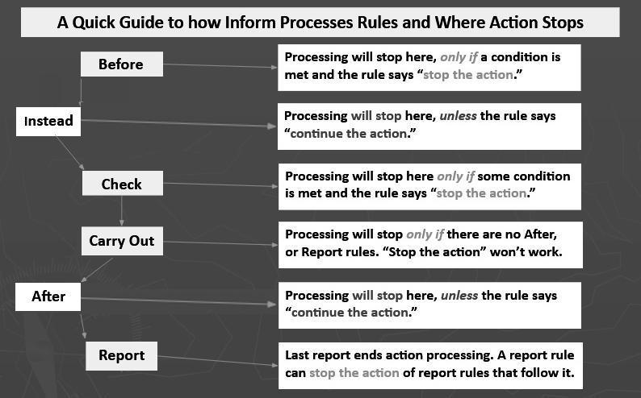

# *Mashed Soup*: An Inform Tasting and Recipe Variously Spiced

**Judith Pintar**

Teaching Associate Professor & Director of the Game Studies and Design Program, School of Information Sciences

University of Illinois Urbana-Champaign

**Category:**  Interactive fiction  
**Class of E-Lit:** Parser-based narrative; world model  
**Required ingredients:** Inform IF language and Borogove IF player  
**Preparation and cooking time:**  About an hour  
**Rating: 🍳🍳** medium (for those new to Inform)

## Background

*Mashed Soup* is an interactive story that provides all the ingredients needed to make a pot of electronic soup. After a quick tasting, you will be guided step-by-step through its recipe, which was written in **Inform**, a "natural language" programming language created by Graham Nelson for the design of parser-based interactive fiction. In parser-based narratives reader-players interact by typing responses rather than clicking; other features are more nuanced. While a **hypertext** story typically links texts to advance or deepen a narrative, and **choice-based** platforms invite readers to make decisions between alternative branching paths, parser-based approaches use text to build the architecture of a simulated world.

**Sample before you cook:** *Mashed Soup* code will serve as a template to help you to create a virtual kitchen. As its designer-chef, you will be able to concoct a pot of soup for player-cooks to make! As you read the tasting, you may find it helpful to play *Mashed Soup* at the same time: [https://mm45nx3c.play.borogove.io/](https://mm45nx3c.play.borogove.io/)

---

## A Tasting of Mashed Soup

```
Cozy Kitchen

In the center of your cozy kitchen a hotplate warms a pot of broth that you hope will become a savory soup

Near at hand is a masher, clearly a tool engineered for perfect mashing.

You can also see a buttery steamed potato, minced garlic and a chopped onion here.

>examine the broth
The mildly spiced broth is simmering.
```

The story emerges in responses to **actions** taken upon objects in the world. As the player-cook interacts with tools and ingredients, some actions are prevented and others are allowed to succeed. The story also suggests actions that could be taken to move the narrative along.

```
>mash potato
You can't do that since you're not holding the masher!

>take masher
You pick up the sturdy, well-worn masher.

>mash potato
You tighten your grip on the masher, ready to do the culinary deed.

You stop in mid-mash, remembering that your grandma said to put the potato in last. Maybe you should read the recipe again.
```

The player cook will expect that anything they "examine" should provide meaningful information. This means that the designer-chef can deliver narrative elements through the descriptions of things (and people). Self-examination of the player character, for example, provides a backstory. The player description can also report what is being worn and held.

```
>examine myself
You're having a hard day. When you were little your grandmother made soup to cheer you up. You figure it is worth a try.

You are wearing a chef's apron. You are carrying a long wooden spoon and a worn index card.

>examine apron
This was Grandma's apron. Grandpa called it her armor. He said she cooked like she was going into battle. Wearing it helps you to remember her.

>examine spoon
Grandpa stirred a lot of soup with this spoon. The long handle is still sturdy, the spoon itself untarnished. You can't use it without thinking about him.

>examine card
The recipe is in Grandma's handwriting. Across the top she wrote "Mashed Soup for One."
```

```
You remember how Grandma prepared the ingredients while Grandpa stirred the soup. Mashing was his job too, and Grandma would joke that she didn't need a blender because she had him. Grandpa died when you were six or seven. Mom bought her an expensive blender, but she wouldn't use it.

Soup for one. You never thought much about what Grandma's life was like. She was happy when you were there. You remember how she would fence with you, masher against wooden spoon, and laugh.
```

The recipe, which the player-cook is carrying, provides a handy To Do list. It also provides a solution to the simple puzzle of the order in which ingredients should go into the soup.

```
>read recipe

Mashed Soup for One

Ingredients:
 a small pot of vegetable broth
 one chopped onion
 some minced garlic
 one steamed and well-buttered potato

Cooking Directions:
 Mash the chopped onion and add it to the broth
 Mash the minced garlic and add it to the onion
 Mash a buttery potato and add it at the end
 Mash the soup
 Warm your solitude
```

Although most player-cooks will want to examine and use the objects they find in the kitchen, as they figure out what they are supposed to do, once the order of ingredients is known it is possible to speed-run the mild version of *Mashed Soup* in just three more turns (after taking the masher).

```
>mash onion
You tighten your grip on the masher, ready to do the culinary deed.

Mash! Mash! Mash! When the task is finished, you add the mashed onion and stir it into the broth.

The broth is starting to smell like soup!

>mash garlic
You tighten your grip on the masher, ready to do the culinary deed.

Mash! Mash! Mash! When you are done, you add the mashed garlic and stir it into the broth.

The broth is almost but not quite soup!

>mash potato
You tighten your grip on the masher, ready to do the culinary deed.

Mash! Mash! Mash! When it is smooth enough, you add the mashed potato into the broth and stir.

Congratulations! You have made soup!
```

The mild version of *Mashed Soup* ends with the mashing of the potato. If you are trying out Inform for the first time, or are instructing beginners, this will be a fine place to end your recipe.

A spicier version walks through a more complicated end-game. It requires the coding of additional actions, like remembering and warming, and modifying existing actions, like eating.

```
>remember grandma
After Grandma died, Mom said you could have anything you wanted from her kitchen. You took her apron and her cooking stuff. You also found a stack of handwritten recipe cards in a drawer, many with "for one" penciled in at the top.

>eat soup
You dip your spoon into the pot. The flavor is just as you remember but the consistency isn't quite right. What would Grandma do?

>mash soup
You toss the masher into the air where it completes three full revolutions before you catch it just as it is about to land in the pot.

Mash! Mash! Mash! The texture becomes creamy and smooth. Now that's mashed soup!

>eat soup
The soup looks amazing, but you hesitate. Something feels undone.

>warm my solitude
You run your finger across the final line in the recipe. What did Grandma mean by this? It feels like a message. You look at her broth-splashed apron and think how you're living alone now too, and not by choice. You serve yourself a bowl of Mashed Soup for One. It warms you through and through.
```

---

## A Recipe for Mashed Soup (variously spiced)

To start cooking up an Inform recipe, download Inform and install the desktop application: [https://ganelson.github.io/inform-website/](https://ganelson.github.io/inform-website/). Alternately, you can compile Inform code online, using Borogove, [https://Borogove.app/](https://Borogove.app/). Moving beyond this recipe will require aspects of the language not covered here. Inform's own documentation is extensive. For support and community, visit [https://intfiction.org/](https://intfiction.org/). Instructors who are using the recipe to teach Inform are invited to post in the education channel: [https://intfiction.org/c/general/education/58](https://intfiction.org/c/general/education/58).

Inform is an **object-oriented language**. This means that the code you write will define different kinds of digital objects: *places* (called **rooms**), *items* (called **things**) and *animate things*, including people, animals and monsters (called **persons**). Each has shared and unique attributes. Assigning values to these is the first step in creating an interactive narrative. After that, your task is to provide appropriate responses to player actions under different conditions. Fortunately, at the beginning and intermediate level, Inform code reads and writes in nearly-normal English.

The Inform development environment has two sides: the left is for the application code and the right displays the interactive story. To compile the code, click the Go button. If Inform displays an error message, check your code against what has been provided here. *Give extra attention to punctuation, which is meaningful in Inform, and the most common source of compiler errors!*

---

### Cooking Directions (mild version)

#### **Step One: Create the Kitchen**

*Mashed Soup* takes place in a kitchen, which will be the first digital object to be made. A location in Inform is referred to as a **room** even when it is out of doors. A room object must be given a **name** and a **room description**. In the code below, after the simple declarative statement that creates the new room, notice that its description is provided inside of quotation marks and ends with a period. The line of code that provides these values is called an **assertion**.

**Task # 1.1**

```inform7
Cozy Kitchen is a room. "You are standing in the center of your cozy kitchen. A hotplate in front of you warms a pot of broth that you hope will become a savory soup."
```

➤ **Try it out!** Copy the code above into Inform or Borogove, compile it to see what happens, and then alter the assertion to create a kitchen of your own devising.

---

#### **Step Two: Make a Cooking Tool**

Like rooms, things added to the world require a name and should be given a description. Unlike rooms, they also need a **location**. In this case the location of the masher is the cozy kitchen. All three values can be set in a single assertion.

**Task # 2.1**

```inform7
a masher is in cozy kitchen. "Near at hand is a masher, clearly a tool engineered for perfect mashing."
```

➤ **Make a cooking tool** for your player-chef to use – it doesn't have to be a masher!

Things can be examined by the player, but rooms cannot. For that reason, things may have two descriptions. The first, which you have just defined, is called an **initial appearance**. It resembles a room description in format and purpose. In fact, it will be announced as part of the room description (see the tasting, above) at the start of the game, when a room is entered, or if the player-cook types "look." The second, its **long description**, will be displayed only when the object is specifically examined by the player-cook. A room cannot be examined in this way.

**Task # 2.2**

```inform7
The description of masher is "This wooden-handled masher is at least half a century old. It is still in great shape."
```

➤➤ Create a long description for your new cooking tool, as in the code above.

Common misspellings, plural forms, and synonyms can be identified using an **understand rule**. This significantly improves the chance that player-cooks' intentions will be understood.

**Task # 2.3**

```inform7
Understand "mashing tool" and "tool for mashing" as masher.
```

➤➤➤ Add an understand rule to create synonyms for your cooking tool.

---

#### **Step Three: Gather your Ingredients**

In the *Mashed Soup* recipe, ingredients are given a name, a location, a long description, and synonyms – but note (below) that they have **not** been given an initial appearance, as the masher was. Look back at the tasting to see the result: their existence is announced to the player in a list at the end of the room description. Play the game through and type LOOK at different points to see that after a player-cook mashes an ingredient, it will disappear from the list.

**Task # 3.1**

```inform7
buttery potato is in cozy kitchen.
The description of buttery potato is "A well-buttered potato is waiting to be mashed."
Understand "potatos" and "potatoes" and "potatoe" and "buttery potatoe" and "well-buttered potato" as buttery potato.

minced garlic is in cozy kitchen.
The description of minced garlic is "Although you have already minced the sauteed garlic cloves, your grandmother told you they could be improved with a little mashing."
Understand "sauteed garlic" and "sauteed garlic cloves" and "garlic cloves" as minced garlic.

a chopped onion is in cozy kitchen.
The description of chopped onion is "The onion has already been chopped and sauteed in olive oil, but your grandma always mashed her onions before adding them to soup."
Understand "onions" and "simmering onions" and "chopped onions" as chopped onion.
```

➤ **Create your own ingredients!** Make sure to give each one a name, a location, a long description and if desired an initial appearance (see the masher code).

Within its object class, certain **kinds of things** have properties specific to their sub-class. The pot is created as a **container** which has the property of being the location for other things. The hotplate is created as a **device** which has the property of being switched on and off. The pot and hotplate (see below) are both created as **scenery**. Scenery has three traits: it can't be picked up, it has no initial appearance and it also won't be listed at the end of the room description. This works here since the player-cook knows about the pot and hotplate from the room description.

**Task # 3.2**

```inform7
a small pot is a scenery container in cozy kitchen.
The description of a small pot is "This pot belonged to your grandmother. It holds the memories of soups gone by."
Understand "soup pot" and "grandmother's pot" as small pot.

A functional hotplate is a scenery device in cozy kitchen. The functional hotplate is switched on.
The description of functional hotplate is "Your kitchen is so cozy that you don't actually have a stove. Fortunately, you do have a compact but completely functional hotplate."
Understand "hot plate" and "functional hot plate" and "heat" and "compact hotplate" and "compact hot plate" as functional hotplate.
```

➤➤ Make a container to cook in and a device to provide heat.

The vegetable broth, like the other ingredients, has not been given an initial appearance, so you might expect it to show up in the long list of ingredients at the end of the room description. If you check the Tasting you'll see that it doesn't! It is not scenery, but its existence will be revealed only when the pot is examined, because it is located inside the small (scenery) pot. Scenery containers are useful because they can "hide" what they contain from being announced in the room description, even if the object inside the container is not itself scenery.

**Task # 3.3 (medium spicy)**

```inform7
vegetable broth is in small pot.
Understand "simmering vegetable broth" and "simmering broth" and "soup" as vegetable broth.
The description of vegetable broth is "The mildly spiced broth is simmering on the heat."
```

➤➤➤ Locate one of your ingredients inside of a scenery container. Compile it to see if you like the effect.

---

#### **Step Four: Adding the Player-Cook**

The **player character** is created automatically when the world is made. It's up to the designer-chef to replace the default description, "As good-looking as ever," with something more interesting.

**Task # 4.1**

```inform7
The description of the player is "You're having a hard day. When you were little your grandmother made soup to cheer you up. You figure it's worth a try."
```

➤ Give your player-cook an appropriate description that provides narrative context.

People have the attribute of being the location of other things, which can be created already **worn** or **carried** at the start of play. Tip: a worn thing that is taken off by the player-cook is still carried, and will be listed in their inventory, but if they "drop" something they are carrying, its location will change to be the current room.

**Task # 4.2**

```inform7
The player is wearing a chef's apron.
The description of chef's apron is "This was Grandma's apron. Grandpa called it her armour. He said she cooked like she was going into battle. Wearing it helps you to remember her."

The player is carrying a long wooden spoon.
The description of long wooden spoon is "Grandpa stirred a lot of soup with this spoon. The long handle is still sturdy, the spoon itself untarnished. You can't use it without thinking about him."

The player is carrying a worn index card.
Understand "recipe" as worn index card.
```

➤➤ Create at least one item the player is wearing and one that they are carrying. After compiling, type "Inventory" during play to see the result.

The most important object in *Mashed Soup* is the recipe. Inform understands that the card and the recipe are the same object, since the word "recipe" has been made a synonym for "index card." Verbs can also have synonyms. "Read," for example, is a built-in synonym for "examine." Because of the likelihood that player-cooks will first "examine the card" and then "read the recipe," more than one response to examining the index card is needed.

Multiple responses are accomplished by adding code to the description of the card. In the rule below, the bracketed terms `[one of]` and `[or]` separate out the different responses, and `[stopping]` tells Inform to print the first description once, and the last one every time after. Inform will randomize the messages instead if `[stopping]` is replaced with `[at random]`. Responses will repeat in a loop with `[cycling]`. Notice the formatting of the text that is also specified through the bracketed terms: `[bold type]`, `[roman type]`, `[italic type]`, `[line break]`, and `[paragraph break]`.

**Task # 4.3**

```inform7
The description of worn index card is "[one of]The recipe is in your grandmother's hand. Across the top she wrote 'Mashed Soup for One.'[paragraph break]You remember how Grandma prepared the ingredients while Grandpa stirred the soup. Mashing was his job too, and Grandma would joke that she didn't need a blender because she had him. You were six or seven when Grandpa died.[paragraph break][italic type]Soup for one.[roman type] You never thought much about what Grandma's life was like. She was happy when you were there. You remember how she would fence with you, laughing, masher against wooden spoon. Mom bought her an expensive blender, after, but she wouldn't use it.[or][bold type]Mashed Soup for One[paragraph break][bold type]Ingredients:[roman type][line break]
a small pot of simmering vegetable broth[line break]
one chopped onion[line break]
some minced garlic[line break]
one steamed and well-buttered potato[paragraph break]
[bold type]Cooking Directions:[roman type][line break]
Mash the chopped onion and add it to the broth[line break]
Mash the minced garlic and add it to the onion[line break]
Mash a buttery potato and add last[line break]
Mash the soup[line break]
Warm your solitude.[stopping]"
```

➤➤➤ If you haven't yet made your recipe, create it now, and try spicing it up with alternative descriptions and formatting as shown above.

---

#### **Step Five: The Joy of Mashing**

Inform doesn't have a built-in action for cooking actions like mashing (or chopping, frying, stirring, etc…), so designer-chefs will have to create desired actions from scratch. This is a multi-step process. An optional preparation is to first define a new property of things to keep track of whether they have been acted upon or not. This is created in two assertions: the first sets out the *possible values*, and the second identifies the *default*.

**Task # 5.1 (mashability)**

```inform7
A thing can be mashed or unmashed.
A thing is usually unmashed.
```

➤ Create a new attribute for objects that will record the processed or cooked state of your ingredients.

To create the new action, the first step is to write an assertion which names it and tells Inform what it will *act upon* (e.g. nothing, one thing, or a thing and a person). A second assertion will communicate to Inform how to *recognize* the action when player-cooks try to do it.

**Task # 5.2 (defining mashing)**

```inform7
Mashing is an action applying to one thing.
Understand "mash [something]" as mashing.
```

➤➤ Using the "mashing" code as a template, create a new action that will help you make your particular recipe.

The third step is to create **rules** which instruct Inform how to respond to the new action under varying conditions. There are three basic rules used to create default responses for every new action. These are **check rules**, which prevent the action from succeeding, **carry out rules** which lay out what happens when an action succeeds, and **report rules** which communicate to the player what just happened. These three core rules are intended to be as general as possible, providing a default response regardless of what is being acted upon. In contrast, **before rules**, **instead rules** and **after rules** serve your particular narrative, delineating what happens under specific conditions.

Inform processes action rules in this strict order: 1) before, 2) instead, 3) check, 4) carry out, 5) after, and 6) report. It is not necessary to employ all six kinds of rules when defining an action. Technically a new action only requires one rule to provide a default response under any condition. But because "mashing" is so central to the story of *Mashed Soup*, and because the deeper mission of the recipe is to help you understand how Inform interprets player actions, there is good reason to step through them all.

##### **Before Mashing:**

A **before rule** allows something to happen *before the processing of an action begins*. Note the use of conditional statements in the before mashing rule below. Every part of this rule, including the punctuation and the tabs, is meaningful. If the "if" and the "else" do not line up, or the colons, semicolons, and quotation marks are switched or omitted, the rule will not compile.

**Task # 5.3 (before mashing)**

```inform7
Before mashing:
	if player does not have the masher:
		say "You can't do that since you're not holding the masher!";
		stop the action;
	else:
		say "You tighten your grip on the masher, ready to do the culinary deed."
```

➤➤➤ Create and compile a before rule for your new action related to whether the player is holding one of the cooking tools you have created or not.

##### **Instead of Mashing:**

In *Mashed Soup*, **instead of mashing rules** are used to make sure that ingredients are added to the pot in a certain order. Instead rules are used to *interrupt and replace* default rules. If that is not the desired effect, it is possible to explicitly tell Inform to "continue the action" under one particular condition, as illustrated in the third example below.

**Task # 5.3 (instead of mashing)**

```inform7
Instead of mashing garlic when onion is unmashed:
	say "You stop yourself, remembering that your grandma's recipe calls for the chopped onion to go into the pot before you mash the garlic."

Instead of mashing potato when garlic is unmashed:
	say "You stop in mid-mash, remembering that your grandma said to put the potato in last. Maybe you should read the recipe again."

Instead of mashing:
	if hotplate is switched off:
		say "There's no point in mashing cold broth.";
	else:
		continue the action.
```

➤➤➤ Try adding instead rules that guide player-cooks into carrying out your recipe as intended. Make use of your new attribute (made in Task 5.1) as the condition.

*Optionally, experiment with "continue the action" until you understand what happens if you leave it out in the third rule!*

##### **Check Mashing:**

The purpose of **check rules** is to *define general circumstances under which a new action will fail*. What should happen if player-cooks try to mash something that has already been mashed? Nonsensical double-mashing can be prevented through a check mashing rule. In the following rule, the designer chef explains to Inform that it should not process any more mashing rules if the ingredient being mashed has already been mashed.

The bracketed `[noun]` is a **text variable**: that means it will be replaced with the printed name of whatever already mashed object the player cook is trying to mash again. Note that for check rules (as with before rules), action automatically continues unless the rule includes the statement, "stop the action."

**Task # 5.3 (check mashing)**

```inform7
Check mashing when noun is mashed:
	say "The [noun] is already mashed.";
	stop the action.
```

➤➤➤ Create a check rule that creates a general circumstance under which your new cooking action will fail.

*Optionally, experiment with leaving off the "stop the action" on a check rule, and see what happens.*

##### **Carry out Mashing**

Like check rules, **carry out rules** are generic – ideally they should work for any noun in any story. A carry out rule tells Inform *what happens when an action succeeds*; in this case, its value should change from "unmashed" to "mashed." Note that carry out rules cannot stop the action even if they contain the statement "stop the action." They will always move on to any available after or report rules (if they exist) which communicate to the player the result of a successful action. In the example below, all the carry out mashing rule does is to change a value and a location.

**Task # 5.3 (carry out mashing)**

```inform7
Carry out mashing:
	now noun is mashed.
```

➤➤➤ Create a carry out rule that can be applied to any noun when your cooking rule succeeds. If you didn't create a property to record its state, do that first.

##### **After Mashing:**

Like instead rules, **after rules** are interventions. The difference between them is that instead rules interrupt default check and carry out rules, usually causing a player action to fail; after rules *interrupt default messages after an action succeeds*. In *Mashed Soup*, for example, an after taking rule replaces the default response for taking things, which is "Taken."

**Task # 5.3 (after taking)**

```inform7
After taking masher:
	say "You pick up the sturdy, well-worn masher."
```

➤➤➤ Write a rule that replaces the default response "Taken" for one of your items.

Like instead rules, *after rules stop the action by default*. For this reason, note that all of the following after mashing rules include the statement "continue the action" at the end.

**Task # 5.3 (after mashing)**

```inform7
After mashing chopped onion:
	now the chopped onion is in the small pot;
	now the description of the chopped onion is "The onion is simmering in the broth.";
	now the description of vegetable broth is "The vegetable broth is simmering with onions.";
	now the description of cozy kitchen is "At the center of your kitchen a hotplate warms a pot of oniony broth that you hope will become savory potato soup.";
	continue the action.

After mashing minced garlic:
	now the minced garlic is in the small pot;
	now the description of minced garlic is "The garlic is infusing the broth with antioxidants.";
	now the description of vegetable broth is "The vegetable broth is smelling more savory by the minute.";
	now the description of cozy kitchen is "At the center of your kitchen a hotplate warms a pot of savory broth that is waiting for its final ingredient.";
	continue the action.

After mashing buttery potato:
	now the buttery potato is in the small pot;
	now the description of potato is "The potato has successfully thickened the broth.";
	now the description of vegetable broth is "You hope that it will taste as amazing as it smells.";
	now the description of cozy kitchen is "At the center of your kitchen a hotplate warms a pot of savory broth full of onions, garlic, and potatoes.";
	continue the action.
```

➤➤➤ Using the preceding code as a template, change the description of objects after they have gone through your cooking action, and anything else that alters as a result!

##### **Report Mashing:**

**Report rules** *communicate to the player-cook the narrative results of an action*. A report rule generally contains a "say statement" which contains text in quotes, much like object descriptions. In another example from *Mashed Soup*, here a report examining rule is used to provide a "list of things" worn or carried by the player. This information can otherwise only be known to the player-cook if they type the command "inventory" during play.

**Task # 5.3 (report examining)**

```inform7
Report examining the player:
	say "You are wearing [a list of things worn by the player]. You are carrying [a list of things carried by the player].[line break]"
```

➤➤➤ Copy this code verbatim into your story; remove it if you don't like the effect.

Note that this rule won't overwrite any description that you may have created for the player character. Report rules are processed last, so they don't replace anything! They are stackable and will all be processed one after another unless one explicitly says to stop the action.

**Task # 5.3 (report mashing)**

```inform7
Report mashing:
	say "Mash! Mash! Mash! When [one of]the task is finished[or]you are done[or]it is smooth enough[in random order], you add the [noun] and stir it into the broth."
```

➤➤➤ Create a report rule for your cooking action that provides a default response that will be printed, regardless of which noun is being acted upon.

*Mashed Soup* uses a report rule to provide, additionally, a narratively-specific responses for mashing different ingredients. Because Inform helpfully keeps track of how many of any kind of object is in any location; that number can be used in a condition to decide when the soup is finished. Check the tasting to see that both of the report rules display when the action succeeds.

**Task # 5.3 (report mashing)**

```inform7
Report mashing:
	if the number of mashed things is 1:
		say "The broth is starting to smell like soup!";
	if the number of mashed things is 2:
		say "The broth is almost but not quite soup!";
	if the number of mashed things is 3:
		say "[bold type]Congratulations! You have made soup![roman type][line break]".
```

➤➤➤ Create a report rule that provides a second message depending on how many things you have so far mashed (or whatever your new property may be). Congratulate the player for finishing your recipe!

This is the end of the recipe for the mildly spiced version of *Mashed Soup*! If your story compiles and you'd like to go further, the spicier version of *Mashed Soup* walks through the process of creating a more complicated ending for the story.

---

### Cooking Directions (Medium Spicy)

#### **Step 1: Spicing up the Narrative**

Not all actions in Inform need to be physical. In spicy *Mashed Soup*, player-cooks are invited to "remember" and "think about" things. In the example below, Inform is told to understand" the actions of remembering and thinking about things as synonymous with "examining" them.

**Spicy Task # 1.1**

```inform7
Understand "remember [something]" and "think about [something]" as examining.
```

➤ Copy this assertion into your code, adding anything else you wish to be a synonym for "examining."

To allow the player-cook to think about things that are not objects in the room, multiple terms are here made synonyms for a single scenery object, called "your solitude." The alternative responses will be displayed in the order provided until the last, which will be repeated, ever after, indicating to the player that they should get back to the task at hand.

**Spicy Task # 1.2**

```inform7
your solitude is a scenery thing in cozy kitchen.

Understand "my solitude" and "grandma's solitude" and "grandma" and "grandmother" and "grandpa" and "grandfather" and "grandma's kitchen" and "the kitchen" and "loss" and "being alone" and "loneliness" and "recipe cards" and "recipes" and "cooking" and "childhood" and "mom" and "dad" and "life" and "death" and "laughing" and "laughter" and "memory" and "memories" as solitude.

The description of solitude is "[one of]After Grandma died, Mom said you could have anything you wanted from her kitchen. You took her apron and her cooking stuff. You also found a stack of handwritten recipe cards in a drawer, many with 'for one' penciled in at the top.[or]Grandma's recipes are from before Grandpa died and she crossed out old ingredient amounts. A few are much older, from when she was feeding a houseful of kids. On those cards, ingredient amounts were increased and later reduced a couple of times.[or]Some of Grandma's recipe cards are new things she was trying out. You remember the first time she made hummus from scratch and got so excited about tahini.[or]The smell of the soup brings your attention back to the task.[stopping][roman type]".
```

➤➤ Create a scenery object with synonyms, followed by a series of alternative responses that will display using whatever scheme – stopping, cycling, or at random – you wish).

---

#### **Step 2: Spicing up the Endgame**

This spicier code allows the player to eat the soup only under the right conditions.

**Spicy Task # 2.1**

```inform7
Instead of eating unmashed vegetable broth:
	if the number of mashed things is 3:
		say "[one of]You dip your spoon into the pot. The flavor is just as you remember but the consistency isn't quite right. What would Grandma do?[or]You test the soup again. It's just not smooth enough.[stopping]";
	else:
		say "The soup isn't finished yet!"

Instead of eating mashed vegetable broth:
	say "[one of]The soup looks amazing, but you hesitate. Something feels undone.[or]Maybe you should read the recipe one more time.[cycling]".

Before mashing vegetable broth:
	if vegetable broth is mashed:
		say "The soup cannot get any more mashed.";
	else:
		if potato is unmashed:
			say "You need to mash the ingredients first!";
		else:
			say "On a whim, you toss the masher into the air where it completes three full revolutions. You catch it by its handle just as it is about land in the pot.[paragraph break]Mash! Mash! Mash! The texture becomes creamy and smooth. Now that's your grandmother's soup!";
			now vegetable broth is mashed;
			now chopped onion is nowhere;
			now minced garlic is nowhere;
			now buttery potato is nowhere;
			now the description of vegetable broth is "It looks and smells just like your grandmother's soup.";
			now the description of cozy kitchen is "At the center of your kitchen is a simmering pot of potato soup.";
			now the description of the player is "Your day isn't as lonely as it began.";
			stop the action.
```

➤ Create instead rules responding to attempts to eat under different conditions.

*Optionally, provide alternative responses using [one of][or], etc…*

To finish *Mashed Soup*, player-cooks must "warm their solitude." Here a carry out rule provides a default response to warming anything other than solitude, while an instead rule processes the player's final command. The statement **end the story finally** triggers Inform's endgame routine.

**Task # 2.2**

```inform7
Warming is an action applying to one thing.
Understand "warm my [something]" or "warm your [something]" or "warm [something]" as warming.

Carry out warming something:
	say "You warm [the noun]."

Instead of warming solitude:
	if broth is unmashed:
		say "You're not sure what it means to warm solitude, but the recipe says you have to finish the soup first, so you decide to do that.";
	else:
		say "You run your finger across the final line in the recipe. What did Grandma mean by this? It feels like a message. You look at her broth-splashed apron and think how you're living alone now too, and not by choice.";
		end the story finally saying "You serve yourself a bowl of [italic type]Mashed Soup for One.[roman type] It warms you through and through."
```

➤➤ To finish your recipe, "end the story" in a narratively satisfying way!

In *Mashed Soup* all six action rules were used. Some designer-chefs collapse carry out and report rules; others load check rules with narrative or write whole stories using only instead rules. These stylistic shortcuts will compile. But a deeper understanding of how Inform processes rules serves to demonstrate how lovely a well-ordered kitchen can be. (See Figs 1 & 2).

---

### Figure 1. The Order of Mashing Rules in Mashed Soup

| Rule Type | What it does |
|-----------|--------------|
| **BEFORE Mashing** | *If masher is held:* "You tighten your grip on the masher…" |
| **INSTEAD of Mashing** | *If player mashing doesn't match the recipe, action stops.* |
| **CHECK Mashing** | *If noun is already mashed, action stops.* |
| **CARRY OUT Mashing** | Noun is changed from unmashed to mashed; action will continue. |
| **AFTER Mashing** | Descriptions are changed (but not displayed); action is allowed to continue. |
| **REPORT Mashing** | "Mash! Mash! Mash!" … *and maybe* "Congratulations! You have made soup!" |

---


###Figure 2. A Quick Guide to how Inform Processes Rules and Where Action Stops

1. **Before** → Processing will stop here, *only if* a condition is met and the rule says "**stop the action.**"
2. **Instead** → Processing will stop here, *unless* the rule says "**continue the action.**"
3. **Check** → Processing will stop here *only if* some condition is met and the rule says "**stop the action.**"
4. **Carry out** → Action is executed; processing continues
5. **After** → Processing will stop here, *unless* the rule says "**continue the action.**"
6. **Report** → Final message displayed to player

---

## Next Steps for Designer-Chefs

### Spicing Up the World

*Mashed Soup* is a "one room game." Since all the action happens in the kitchen, the narrative doesn't need the geographic exploration for which parser-games are famous. You may expand your map by adding adjacent rooms and putting objects in those locations. Rooms are added by naming them and defining their mapped relationship to each other. A pantry, for example, may be created with a simple assertion:

```inform7
Dark Pantry is east of Cozy Kitchen.
```

The kitchen will automatically be mapped west of the pantry so that the player-cook can move between kitchen and pantry with commands "go east" and "go west." Besides the eight cardinal directions, rooms can be mapped "up" and "down" from, and "inside" and "outside" of each other. Designer-chefs worth their salt will communicate to player-cooks through the room description text where they can go, and what they need to say to get there. Both room and item descriptions should suggest to them the correct wording of actions that will trigger narratively important responses.

### Spicing Up the Kitchen

The spicy play-through of *Mashed Soup* incorporates other actions player-cooks are likely to try in a kitchen, like stirring, smelling, tasting, and spicing. Try reverse-engineering those actions in your own kitchen!

*Dobar Tek! Mashitke Meogeo! Bon appetite!*

---

## Ingredients

**Required:**
- [Inform 7 desktop application](https://ganelson.github.io/inform-website/) — OR —
- [Borogove](https://borogove.app/) (online Inform compiler)

**Optional:**
- [intfiction.org](https://intfiction.org/) community for support
- [Education channel](https://intfiction.org/c/general/education/58) for instructors

## Notes

- The recipe teaches Inform fundamentals through world-building and custom action creation
- "Mild" version ends after mashing all ingredients; "medium spicy" adds emotional narrative resolution
- Punctuation is meaningful in Inform and is the most common source of compiler errors
- Full code is available by playing and examining the source at the github_link above
- The recipe works for both desktop Inform and browser-based Borogove
