# **Modest Beginnings**   
Milagros Vilaplana, MFA  
Master of Fine Arts  
San Diego State University

**Class of E-Lit: E-Poetry**  
**Dish: Animated poetry**  
Model:[https://youtu.be/IocvcQZVbfY](https://youtu.be/IocvcQZVbfY)

**Required Ingredients:**

* Word bank (start with SKIN, SWIM, SLIP…build as you go)  
* Object/ image slide bank (start with nude bodies, water…build as you go)  
* Microsoft PowerPoint motion & animation effects (text fly-ins, word morphs, image morphs, others)

**Preparation and cooking time:** 3-4 hours  
**Rating:🍳 🍳** medium

## **Background:**

For a writer/poet who wants to experiment with mixed media poetry but has limited skills in computer technology it may seem as challenging to create digitally as it may be for a well-versed technology artist who is unfamiliar with kinetic, concept art poetry on the screen. In this paper, we will show that Microsoft PowerPoint offers an easy way to explore more possibilities within poetry, ways to synthesize, deconstruct, hybridize, and expand in audio and visual spaces.

Although artists like *Talking Head*’s lead composer David Byrne and the poet Brent Amaneyro have shown us poetic pieces developed in Microsoft PowerPoint, its use as an artistic platform is not widespread. Maybe there is a resistance to breaking the paradigm of the business corporate nature of MS tools. Another may be that the now defunct Adobe Flash set impossible standards that cannot be fully replicated with current available computer apps and languages. In this context we invite you to have fun in creating post-modernist concept or concrete poetry on an electronic screen.  

As an art form we need to stress the primordial, universal requirement of digital poetry: art that uses aesthetic and rhythmic qualities of traditional text language and other visual and graphic elements to evoke meanings, emotions, thoughts and ideas in a creative, often figurative way, going beyond literal communication, using the expressive power of media at its disposal.

## **Sample Before you cook:**

[https://archive.org/details/david-byrne-eeei/DavidByrne\_EEEI\_1\_Architectures\_Of\_Comparison.VOB](https://archive.org/details/david-byrne-eeei/DavidByrne_EEEI_1_Architectures_Of_Comparison.VOB)

[https://haydensferryreview.com/luck-by-brent-ameneyro](https://haydensferryreview.com/luck-by-brent-ameneyro)

[https://youtu.be/SwfvmjyFa2c](https://youtu.be/SwfvmjyFa2c) Water Birds Fish by Milagros Vilaplana

## **Category:** 

## **“Swept Skin Slid”**

model:

[https://youtu.be/IocvcQZVbfY](https://youtu.be/IocvcQZVbfY)

## **Required Ingredients:**

* Word bank (start with SKIN, SWIM, SLIP…build as you go)  
* Object/ image slide bank (start with nude bodies, water…build as you go)  
* Microsoft PowerPoint motion & animation effects (text fly-ins, word morphs, image morphs, others)

**Preparation and cooking time:** 3-4 hours.  

**Rating:🍳 🍳** medium

## **From the Chef:** 

The time to develop and level of difficulty will depend on the cook’s familiarity with advanced features of Microsoft PowerPoint. If you have only used Microsoft PowerPoint for template-based business presentations, the learning curve will take longer. For first run-through of your dish estimate two hours. Plan on making corrections and iterations. The final touches may take another hour.

Below is an illustration of what your final slide series will look like.

  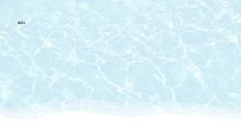
  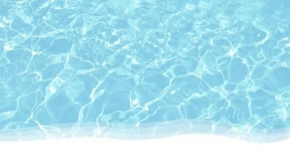
  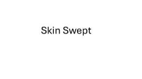
  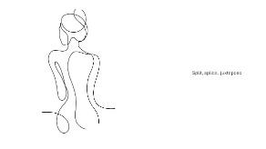
  
  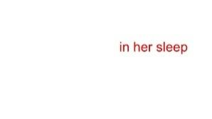
  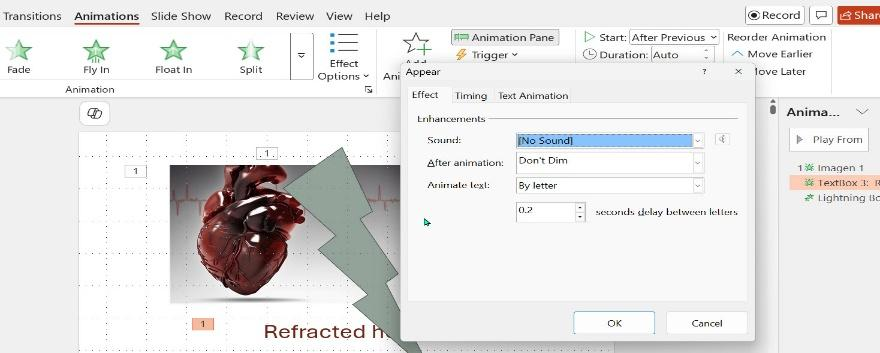
  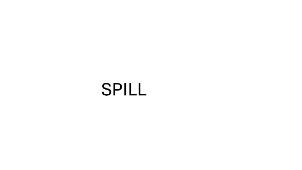
  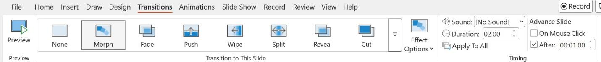
  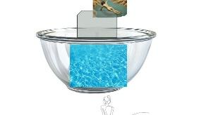
  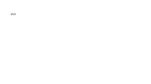
  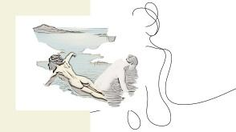
  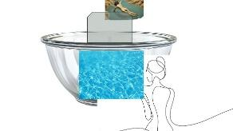
  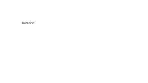
  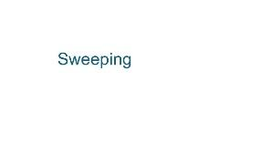
  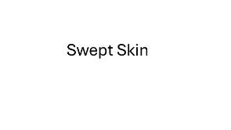
  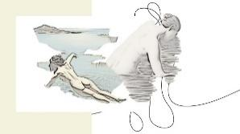
  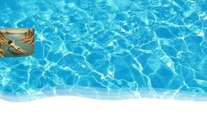
  
  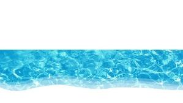
  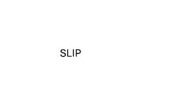

## **Directions:**

STEP 1: Make duplicate slides with a beginning water image.

Details:

Open a blank Presentation in Microsoft PowerPoint, click on the Insert tab, and under New slide, select Blank. Click on Insert, then Pictures, and select the desired photos from the location on your computer.

Highlight the slide, right click and select Duplicate slide two times, so you end up with three identical slides.

STEP 2: Now “blur” the duplicate images progressively.

Details: 

On the second slide, click/ highlight the image. Go to the Picture Format tab, then click on Artistic Effects and choose a lighter background. Repeat this step for the third slide with an even blurrier effect from the same options.

STEP 3: Create the illusion of movement between the images by using the Morph function.

Details:

With the slide you are transitioning from selected, go to Transitions, click on Morph, and ensure you have the Object effect options. You can preview by selecting the Preview option in the left-hand corner.

STEP 3: Introduce text boxes for your theme, i.e. “skin” and then other lyric/ related word chains:  

Details:

On the third slide with the lightest background bring in a text box with small font size (18 pt.).

Make a duplicate slide for this slide, where you eliminate the background image. Duplicate this slide and enlarge the font size (60 pt), keeping the same position.

STEP 4: Create additional text boxes with semantically, or phonetically related words, i.e. “slip”/ “spill,”/ “Sweeping “/”in her sleep” and then use the Morph function on each initial text. 

Details:

As above, insert a new blank slide for each new word, make a duplicate slide of it, and in the second slide key in the change, whether text size, color, or related new phrase, even location in the slide, always in the duplicate slide. 

Go back to the first text and from there add the Morph function. Then, go to Effects Options and choose “Characters” on the second line down. Preview as you go along.

STEP 5: Continue to use the Morph function to transform images and pictures and watch how the visual effect may be even more striking than with words. In separate slides, bring in an image from the object bank, then duplicate each slide, and make changes to the duplicate slide as you did in Step 3 with text boxes.

STEP 6: Once you’ve worked with a group of slides go to the Slide Presentation tab to view your progress. We recommend you set up your slide show so that it runs like a video on its own. To do this go to the far-right side of the Transitions bar and select a time for each side that is about 2 seconds, ensure that all slides are run After a time you want, and that you have selected “Apply To All” as shown below.

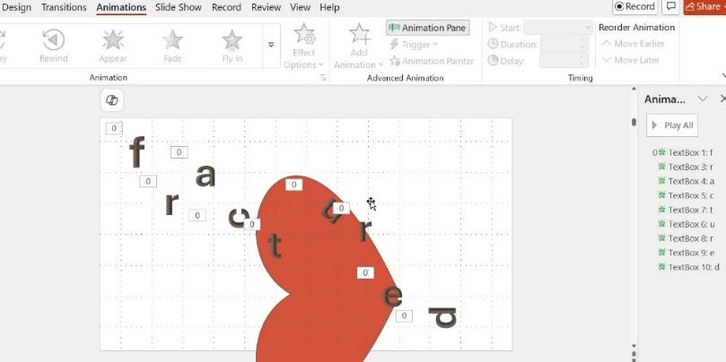

 STEP 7 Work on an entire array of slides to create coherence or unity as you would when drafting a poem (or a visual story) with all your newly created elements of wordplay, visual effects, and layers of meaning. Notice that you can also work with other transition options in the future, or if you’re tempted you can try them now.

STEP 8 Introduce sound elements by using the Media feature (the speaker icon). 

Find something you love, add it and play it using the Slide Show tab, to see how your selection might work with the visual composition you’ve assembled. Jazz pieces with their emphasis on improvisation and rhythmic beats are often well suited for digital poems. To do this, ensure you have the music downloaded on your device. Choose Audio in the far-right option on the bar for Media. Then as you do for pictures, choose the piece from your computer.  

## **Notes and Variations:**

We approach art as an on-going, generative process with little fixed *a priori* design of its final structure or meaning. The theme for this example emerged from the concept of the word SKIN, imagining a nude woman floating and transmuting, as if struggling to define herself through her body, so we brought in the global concept of water for context and visual appeal. The piece is open to the viewer’s own sense, interpretation or mere enjoyment of the experience. 

As a first stab at Microsoft PowerPoint, using the Morph function can produce a satisfying digital poem. But there are many other features that are fun to use.  In this second recipe, the emphasis will be in using the Animations tab, to produce kinetic, concrete, typographic pieces, in other word letters that move, that create shapes, and that are themselves a repurposed form.

**Category:**

## **Thrum Heart *Effrects***  
model**:** [https://youtu.be/gwlpbimXnUU](https://youtu.be/gwlpbimXnUU)

## **Required ingredients:**

* Lyric or meaningful 3-to-5-word strings  
  * *Refracted heart fracture facts*  
  * *Mon pauvre cœur a peur (French)*  
    * *craque d’un jour a l’autre*  
  * *Pulso pulgar palpita (Spanish)*  
  * *Del telar del pulpito vuelca su vulva  (Spanish)*  
* Other single words  
  * *meurt, fractuals, effects*  
* Object/ image bank with Power Point Designer variations

## **Preparation and Cooking time:** 4.5 hours

To prepare for this recipe some familiarity with PowerPoint Advanced Motions is desirable. Exploring Advanced Animations and practice with Animation Pane options will be a plus for cooks that have not used these before.

## **From the Chef:**

We started by imagining the word heart and the heart organ and what it might represent. As we dropped elements on the slide canvas, the theme that emerged was the precariousness of the physical and emotional heart. We loved the word “coeur” in French (and its resonance with care in English) and its signifying rhyme with “peur” in French, which means fear. 

*Since we wished to have a trilingual show in the end* as a subtitle for the piece we added “pobre mi corazón” which in Spanish also signifies a state of impoverishment, be it sentimental or economic poverty.  Some of the word strings in the recipe ingredients are internal dialogues. We wanted to evoke the materiality of a human organ and what it may symbolize, to different readers.

## **Directions:**

STEP 1:

To start creating image variations first insert a picture on a blank slide by searching using the word “heart” either from stock pictures or from your device. After opening the Picture Format Picture tab, click on Remove the Background to have the heart image stand on its own. Add a text box with the word strings ¨Refracted heartfelt facts” or create your own.

STEP 2:

Duplicate the first slide several times. Modify each successive picture using Picture Format drop down option labelled “Artistic effects”.  Apply the Morph function to the new slides as you did in the first recipe. Eliminate the text box, enhance it or cut it. We disappeared it.

STEP 3:

To produce kinetic word or letter effects, you will be using the Animations tab from the MS Power Point bar and applying motions on text boxes, starting with the word strings. 

For this example, select a first box and click on Appear. Then open the Animation Pane and open Picture 1 there, to apply Effect Options to the text. On this option, choose “by letter” as shown below.  

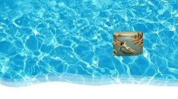

Use the Preview option to see how each individual character will appear successively on the screen, drawing the viewers’ attention to read or enjoy the movement of letters as making them out.

STEP 4:

For a more concentrated *lettrist* effect, as a quote from Kenneth Goldsmith from *The New Concrete* suggests, “Letters would double as carriers of semantic content and as powerful visual elements in their own right” you can make a text box for each letter of a word as we did in Slide 4\. 

We animated each letter with the Appear animation option. Below we show the Animation Pane and how each picture will be listed numerically. Click on each picture on the Animation Pane and set it to “After Previous”.

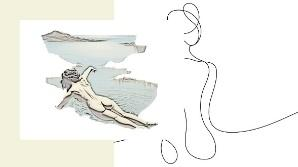

STEP 5:

Insert the “Morph” function between slides where you want to move an image or word.  Interesting options include resizing image with a rhythm and selecting a sound effect option from the Animation pane. Timing should generally be at Fast, or Medium. 

STEP 6:

Use the Slide Show presentation option for reviewing a part series or the entire slide show poem. 

**Notes, Tips and Variations:** 

Some points we consider when creating a digital poem in Microsoft PowerPoint are:

* Use a cyborg approach (technology as partner); Microsoft PowerPoint will offer designer suggestions as well as the recent “Copilot” interface.  
    
* Inductive process (start small, focus on moment, emphasis on discovery)  
    
* Play, ask & explore (leave your discourse open to dilemma, controversy, self-questioning)  
    
* 21st “deconstructivist” (breakup language & meaning)  
    
* Avoid rant or commentary (but if done deliberately, or as voice of consciousness, allow a public, “Greek chorus” style)  
    
* It’s all about context (not so much the individual); Real developers of the Microsoft PowerPoint language features with their perspectives were behind the tool   
* Leave sketches or unfinished aspects or backroom entrails of the piece exposed; roughness, difficulty, incompleteness (to contrast with commercial consumer entertainment) are welcome

Design and text ideas can be derived from practices of concrete and kinetic poetry and lettrist/ typographic variations can be experiments, for absorbing into a Microsoft PowerPoint digital poem, as the canonic typographic variations of e.e. cummings or the very contemporary codework of in Mezangelle (@MezBreezeDesign).

Lastly, remember our leitmotiv for digital poetry: *Venture to improvise\!* 

## **Resources:**

Highly recommended primer on digital poetry: 

Di Rosario, Giovanna, “Digital Poetry: a Naissance of a New Genre?” *Carnets, 1(Numero Special), 2009, pp. 183-205. (hyperlink below)*

[https://journals.openedition.org/carnets/3762\#:\~:text=As%20for%20text,making%20it%20unique](https://journals.openedition.org/carnets/3762#:~:text=As%20for%20text,making%20it%20unique)

Stefans, Brian Kim, “The Dream Life of Letters.” 2000 

(created in Adobe Flash in a “saved format” by using the following url: [https://collection.eliterature.org/1/works/stefans\_\_the\_dreamlife\_of\_letters.html](https://collection.eliterature.org/1/works/stefans__the_dreamlife_of_letters.html). 

There are many more works in the Electronic Literature Collection: [https://collection.eliterature.org/](https://collection.eliterature.org/) dating back to 2006\. 

For creative text installations we find the following fascinating: [https://www.anatolknotek.com/](https://www.anatolknotek.com/)

