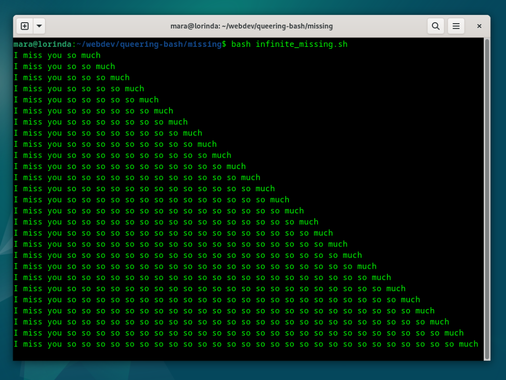

# Queering Bash: Love Poems, as Recipes

**Chefs:** Winnie Soon and Mara Karagianni

Winnie Soon  
Associate Professor & Director, BA Art and Technology Program, Slade School of Fine Art  
University College London (UCL)

Mara Karagianni  
Assistant Professor in Digital Arts (artist, software developer & technologist)  
École de Recherche Graphique (ERG)

**Class of E-lit:** E-Poetry  
**Dish:** a simple starter for electronic poetry  
**Required ingredients:** A computer with a Bash terminal access  
**Preparation and cooking time:** 30 minutes   
**Number of servings and serving size:** 1 with seven lines of code  
**Rating: 🍳 one pan, easy**

# **Background:** 

## **Understanding Bash kitchen**  
Bash, created in 1989, is the acronym of “Bourne Again Shell”– a pun on its proprietary predecessor Bourne shell–. A shell, known also as a computer terminal, console window or Command Line Interface (CLI), serves as the scripting language for navigating the computer’s filesystem, and automating tasks such as writing system logs, scheduling backups, and updating certificates. Unlike Graphical User Interfaces (GUI), the terminal is a text-based interface where users type commands like echo "hello world" to instruct the system directly—unlocking powerful capabilities often hidden from the GUI. Bash is accessible via the terminal, and it belongs to a lineage of Unix shells starting in 1971, which continues to grow today with glamorous styled shells such as the Charm ([https://charm.sh/](https://charm.sh/)). 

Bash outshines at automating recipes for system administrators, from prepping servers to cultivating safety habits, making it an essential tool in the daily tasks of Unix systems (a multi-user computer operating systems, whose development started in 1969\) like Linux and MacOS, with ports available for Windows as well. But the kitchen setting is changing. As tech oligopolies like Amazon Web Services (AWS) roll out their proprietary appliances in mass, such as browser based dashboards and cloud based applications, the role and the skillset of the system administrator is shifting (Soon & Karagianni). 

Whereas a terminal-based system administrator would work with bash recipes, piping one into another to experiment with personal flavors, while acquiring a deeper knowledge of the server’s filesystem and networks, the cloud based system administrator clicks through web pages, ticking boxes, dwelling in what is termed as vendor-locked environment. That is an edifice that provides technological solutions, so called infrastructures as services (Kaldrack & Leeker 10), which work only within a company’s specific data cloud configurations. From the era of terminal-based software as a steering engine of computing, to GUI based applications, we have reached the abstraction of data infrastructures into cloud computing, going beyond the GUI, surrounded by ubiquitous dashboards and apps that render online connectivity mandatory. The hands-on craft of system administration has been dominated by an oligopoly of cloud based infrastructures, creating a digital landscape often referred to as the Big Tech, a mega kitchen.

## **Queering Bash kitchen**  
This *Bash kitchen* embraces the poetics of code—generative, evolving, ephemeral poems served as tasters—that explore the interplay between love language and machine logic. A queer bash kitchen highlights the potential of computation not just as a tool of efficiency, but as a site of vulnerability, ambivalence, creative (and culinary) subversion.  
We reflect:  
*"Queering is, thus, understood as specific appearance, gathering, performing, as a disturbance of order."* (Götz 18\)  
*"\[Q\]ueer spaces per se do not exist, neither do queer things \- it is their use that makes them potentially queer spaces of things"* (Götz 18\)

## **From the Chef:**   
**Ingredients for a shimmering Queer Love Poem**  
**a. Elegance**  
Write code that does one thing—  
*and does it poetically.*  
Let your algorithms be simple,  
your data structures tender.  
When lost in logic, lean into queer intuition.  
**b. Fusion**  
Craft programs that shimmer—  
written to run, but meant to feel.  
Let syntax speak as much as it runs.  
**c. Diversity**  
Let your lines mean more than one thing.  
Syntax, like love, should resist singular readings.  
**d. Fuzziness**  
Write with feeling first.  
Let poetry bloom before compiling.  
**e. Separation**  
When missing,  
code a poem for the one not there—  
let code become a letter.  
**f. Presence**  
Write for the NOW.  
Because feelings matter.

## **Directions:**

**Queer Kitchen Ambience**  
Once our computer is on, we can find the terminal through the file manager. On a Mac computer, we open the Finder window, and in the search bar, we type “Terminal.app.” On a Windows computer, we search for the ‘PowerShell’ in the applications. The Terminal application icon will show up in the results. Once we double click the terminal application icon, a window appears—often black—with a line of text at the top of the window: 

```bash
queer@joy:~$
```

The name before the “@” symbol is our username, and the name after is the machine’s. This first line, we call it the command prompt, which is our entry point for communicating with the machine.  
Commands are built-in keywords that allow us to navigate our computer through text. For example, we can type 'pwd' (print working directory) to reveal our current location within the filesystem’s hierarchy. By default, the terminal opens in our home directory, such as:

```bash
queer@joy:~$ pwd
/home/queer
```

If we want to make a new recipe, we can create a new directory using the 'mkdir' (make directory) command. 

```bash
queer@joy:~$ mkdir queerkitchen
```

Boom—our **queerkitchen** should now appear at the bottom of the list, freshly created\! To enter the queer kitchen, type:

```bash
queer@joy:~$ cd queerkitchen
```

   
## **Starter code:**   

### **Serving Dish \- Infinite Missing**  

*The terminal output of infinite missing*

```bash
while $love
how="so"
do
  so+="${how} "
  echo I miss you $so much
  sleep 0.2
done
```

The source code of infinite missing  
**Chopping together \- step by step**  
**Step 1:** Create your love letter  
Open a new file in the terminal with the ‘nano’ command (or ‘edit’ in Windows: https://learn.microsoft.com/en-us/windows/edit/), which is calling a terminal based text editor:

```bash
queer@joy:~$ nano infinite_missing.sh
```

	**Step 2:** Write your feeling  
 	Inside the file, type:  
	

```bash
echo “I miss you so much”
```

**Step 3:** Save the message  
Press ctrl/cmd \+ X, then type Y, and hit Enter to save and exit.

**Step 4:** Read it aloud (via Bash)  
	Back in the terminal, run:  
	
```bash
queer@joy:~$ bash infinite_missing.sh
```

	 You'll see your message—simple, direct, like the first line of a love poem.

	**Step 5:** Make it linger  
	Let’s now echo this line forever—a loop of longing. Edit the file again:

```bash
queer@joy:~$ nano missing.sh
```

	Replace the content with:  
	
```bash
while true:
  do
     echo "I miss you so much"
    sleep 0.2
  done

```

Each heartbeat of “missing” now pulses through your terminal (for every 0.2 seconds). To stop the loop, press Ctrl \+ C

**Step 6:** Add softness and depth  
Let's stretch the "so" with each repetition:

```bash
while true:
 do
    so+= “so ”
    echo I miss you $so much
    sleep 0.2
  done

```

Now the longing builds—"so so so much"—growing with every loop, like a feeling that keeps returning, never quite still. With each line printed to the terminal, the expression expands.

In Bash, variables are called by placing a $ in front of their name. The \+ sign adds to what was already there—so each time the loop runs, another “so” is appended, layering the sentiment line by line.

**Step 7:** Queerring poetics  
Change the loop's logic to something tender.

```bash
love=true
while $love:
  do
    so+= “so ”
    echo I miss you $so much
    sleep 0.2
  done
```

We begin to rewrite the logic of longing: 

* We have assigned the true value to something queer—a variable named love.  
* We can call these variables everywhere else in our code. So the loop now changes from while true to while $love, but executes in the same way, as a while true  statement.


  **Step 8:** Becoming a piece of codework

```bash
while $love
how="so"
do
  so+="${how} "
  echo I miss you $so much
  sleep 0.2
done

```

    
  Moreover, the true statement doesn’t need to be explicitly defined; in Bash, any variable—even if undeclared—will still evaluate as true in a loop condition, as long as it is not assigned to null or an empty string. To deepen the expression of missing, we introduce another variable, how, and use it to echo the intensity. But soon, we notice a rush of words—*sososososo...*—with no room to breathe. Therefore, we place the variable inside quotes and add a space: "so ". Since Bash requires curly brackets ${how} when referencing a variable inside quotes, we adjust accordingly.

    
  You’ve replaced true with love, and *incremented* longing in a loop. The syntax becomes poetry: repetition as rhythm, code as confession.

**Variations and Related recipes:**  
Compose your own language poem by replacing the variable names and crafting the output text:

For example:

1. change while $love to while $hot  
2. change echo I miss you $so much to echo I want you $so badly  
   See other dishes cooked in the Queer Bash Kitchen: [https://git.systerserver.net/systerserver/queering-bash](https://git.systerserver.net/systerserver/queering-bash)

**References:**  
Charm. *Charm\_We Make the Command Line Glamorous*, [https://charm.sh/](https://charm.sh/). Accessed 9 Nov. 2025\.  
Götz, Magdalena. “Queering Practices: Uses of Digital Mobile Media in Queer/Feminist Art.” *CRC Media of Cooperation Working Paper Series*, no. 18, 2021, pp. 15–22. [http://piaer.net/wp-content/uploads/2021/07/Goetz\_2021\_Queering\_Practices\_in\_WPS\_18\_Practice.pdf](http://piaer.net/wp-content/uploads/2021/07/Goetz_2021_Queering_Practices_in_WPS_18_Practice.pdf). Accessed 9 Nov. 2025\.  
Kaldrack, Irina, and Martina Leeker. “Introduction.” *There Is No Software, There Are Just Services*, edited by Irina Kaldrack and Martina Leeker, meson press, 2015, pp. 9–19. [https://meson.press/books/there-is-no-software-there-are-just-services/](https://meson.press/books/there-is-no-software-there-are-just-services/). Accessed 9 Nov. 2025\.  
Raymond, Eric Steven. *The Art of Unix Programming.* Addison-Wesley Professional, 2003\. [http://www.catb.org/\~esr/writings/taoup/html/](http://www.catb.org/~esr/writings/taoup/html/). Accessed 9 Nov. 2025\.

Soon, Winnie, and Mara Karagianni. *Queering Love Letters* \[Slide deck\]. HackMD, 2023, [https://hackmd.io/@siusoon/queeringbash2](https://hackmd.io/@siusoon/queeringbash2). Accessed 9 Nov. 2025\.

